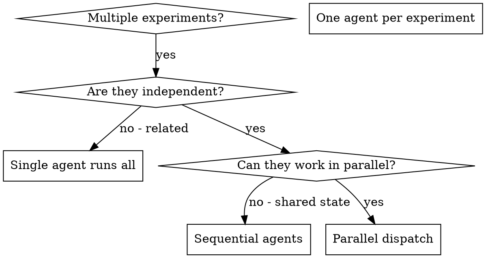

# Dispatching Parallel Agents

## Overview

When you have multiple independent experiments (different datasets, different methods, different baselines), running them sequentially wastes time. Each experiment is independent and can happen in parallel.

**Core principle:** Dispatch one agent per independent problem domain. Let them work concurrently.

Use this skill alongside:
- `amplify:experiment-execution` for Phase 4 orchestration
- `amplify:results-verification-protocol` before claiming completion
- `amplify:results-integration` when consolidating outputs

## When to Use



**Use when:**
- 3 independent experiments on different datasets
- Multiple baseline implementations to evaluate
- Each experiment can be understood without context from others
- No shared state between experiments

**Don't use when:**
- Experiments are related (result of one informs another)
- Need to understand full system state
- Agents would interfere with each other

## The Pattern

### 1. Identify Independent Domains

Group experiments by what they investigate:
- Experiment A: Baseline model on dataset X
- Experiment B: Proposed method on dataset Y
- Experiment C: Ablation study on component Z

Each domain is independent - running the baseline doesn't affect the ablation study.

### 2. Create Focused Agent Tasks

Each agent gets:
- **Specific scope:** One experiment or method
- **Clear goal:** Run this experiment and collect results
- **Constraints:** Don't change shared code or other experiments
- **Expected output:** Summary of findings, metrics, and artifacts

### 3. Dispatch in Parallel

Use the **Task tool** to launch subagents. The Task tool is the standard mechanism for spawning independent subagents in Cursor and similar AI development environments.

**How to invoke:** Call multiple Task tools in a single response. Each Task runs as an independent subagent with its own context.

```
Call Task tool with:
  description: "Run baseline on dataset X"
  prompt: |
    [Full self-contained prompt — see Agent Prompt Structure below]
  subagent_type: "generalPurpose"

Call Task tool with:
  description: "Run proposed method on dataset Y"
  prompt: |
    [Full self-contained prompt]
  subagent_type: "generalPurpose"

Call Task tool with:
  description: "Run ablation on component Z"
  prompt: |
    [Full self-contained prompt]
  subagent_type: "generalPurpose"
```

**Critical:** All three Task calls go in the SAME message, so they execute concurrently. If you put them in separate messages, they run sequentially.

### 4. Review and Integrate

When agents return:
- Read each summary
- Verify results don't conflict
- Run validation checks
- Integrate all findings

## Agent Prompt Structure

Good agent prompts are:
1. **Focused** - One clear experiment or problem domain
2. **Self-contained** - All context the subagent needs (it has NO access to your conversation history)
3. **Specific about output** - What should the agent return?
4. **Include file paths** - The subagent starts in the workspace root; give absolute or relative paths

```
Call Task tool with:
  description: "Run baseline on sentiment dataset"
  prompt: |
    Run the baseline experiment on the sentiment analysis dataset.

    Project root: [workspace path]

    Steps:
    1. Load the pre-trained model from checkpoints/baseline-v2
    2. Evaluate on test split of sentiment-benchmark
    3. Collect metrics: accuracy, F1, precision, recall

    Configuration:
    - Batch size: 32
    - Use GPU if available
    - Log results to experiments/baseline-sentiment/

    Do NOT modify the model code or training pipeline.

    Return: Summary of metrics, any anomalies observed, and path to saved results.
  subagent_type: "generalPurpose"
```

## Common Mistakes

**Bad: Too broad:** "Run all the experiments" - agent gets lost
**Good: Specific:** "Run baseline on sentiment dataset" - focused scope

**Bad: No context:** "Evaluate the model" - agent doesn't know which model or data
**Good: Context:** Specify model path, dataset, metrics, and configuration

**Bad: No constraints:** Agent might refactor everything
**Good: Constraints:** "Do NOT change model code" or "Evaluation only"

**Bad: Vague output:** "Run it" - you don't know what was measured
**Good: Specific:** "Return summary of metrics and path to artifacts"

## When NOT to Use

**Related experiments:** Result of one informs the next - run sequentially
**Need full context:** Understanding requires seeing entire research pipeline
**Exploratory analysis:** You don't know what to investigate yet
**Shared state:** Agents would interfere (writing same output files, using same GPU)

## Real Example from Session

**Scenario:** 3 independent experiments needed after method development

**Experiments:**
- Dataset A evaluation: Baseline model performance (accuracy, F1)
- Dataset B evaluation: Proposed method with hyperparameter sweep
- Ablation study: Component contribution analysis on validation set

**Decision:** Independent domains - each dataset/method combination is separate

**Dispatch** (all three Task calls in one message):
```
Task(description="Baseline on Dataset A", prompt="...", subagent_type="generalPurpose")
Task(description="Proposed method on Dataset B", prompt="...", subagent_type="generalPurpose")
Task(description="Ablation study", prompt="...", subagent_type="generalPurpose")
```

**Results:**
- Agent 1: Baseline accuracy 78.3%, F1 0.76 - logged to experiments/baseline-A/
- Agent 2: Best config found (lr=3e-4, layers=6), accuracy 84.1% - logged to experiments/proposed-B/
- Agent 3: Attention component contributes +3.2%, embedding component +1.8% - logged to experiments/ablation/

**Integration:** All results independent, no conflicts, comprehensive comparison table built

**Time saved:** 3 experiments completed in parallel vs sequentially

## Key Benefits

1. **Parallelization** - Multiple experiments happen simultaneously
2. **Focus** - Each agent has narrow scope, less context to track
3. **Independence** - Agents don't interfere with each other
4. **Speed** - 3 experiments completed in time of 1

## Verification

After agents return:
1. **Review each summary** - Understand what was measured and found
2. **Check for conflicts** - Did agents write to the same output paths?
3. **Run validation** - Verify all results are reproducible
4. **Spot check** - Agents can make systematic errors

Before declaring success, invoke:
- `amplify:results-verification-protocol`
- `amplify:claim-evidence-alignment` (if claims are being prepared for reporting/writing)

## Real-World Impact

From research session:
- 3 independent experiments needed
- 3 agents dispatched in parallel
- All experiments completed concurrently
- All results integrated successfully
- Zero conflicts between agent outputs
