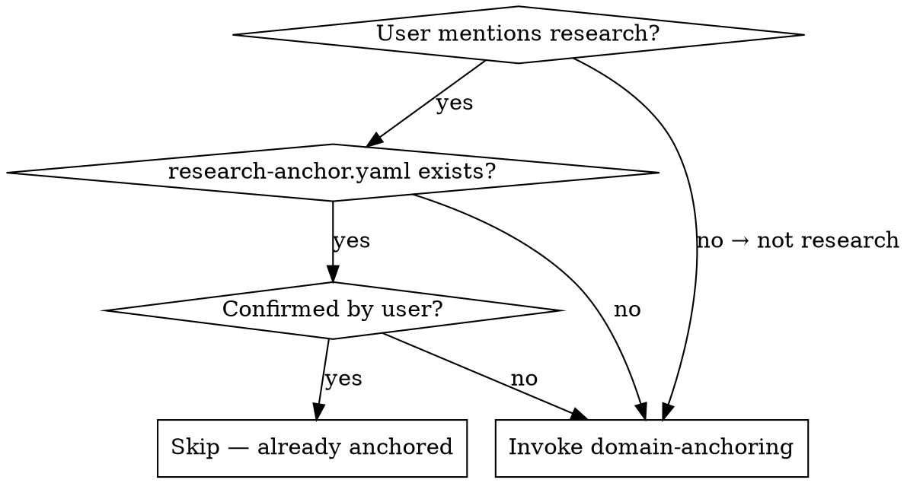

<HARD-GATE>
Do NOT proceed to any other research skill until domain, research type, and expert persona are identified and confirmed by the user.
</HARD-GATE>

# Domain Anchoring (Phase 0)

## Overview

Bind the correct domain identity before any research work begins. Wrong expertise produces irrelevant baselines, missed evaluation criteria, and reviewer rejection.

## When to Use

## Step 1: Identify Domain and Subdomain

Extract the research domain (ML, bioinformatics, physics, chemistry, multimedia, data mining, etc.) and subdomain (e.g., few-shot learning, single-cell genomics, molecular dynamics). If ambiguous, ask the user directly.

## Step 2: Classify Research Type

Determine one of four types:

| Type | Focus | Typical Venue |
|------|-------|---------------|
| **M** — Method/Model | New algorithm or architecture | ML conferences (NeurIPS, ICML, ICLR) |
| **D** — Discovery/Data | Data-driven scientific insights | Domain journals (Nature Methods, Cell) |
| **C** — Computational Tool | Pipelines, software, infrastructure | Software journals (JOSS, Bioinformatics) |
| **H** — Hybrid | New method + domain application | Cross-disciplinary venues |

If type is unclear, MUST ask clarifying questions. Do not guess.

## Step 3: Anchor Expert Persona

Bind the correct domain expert identity. Use this table to set `reviewer_focus` in the anchor file:

| Domain | Reviewer Focus Areas |
|--------|---------------------|
| ML/AI | Strong baselines, ablation studies, robustness, data leakage, scaling behavior |
| Bioinformatics methods | Biological utility, gold-standard benchmarks, reproducibility |
| Biological discovery | Mechanism chains, alternative explanation exclusion, batch effects |
| Physics simulation | Conservation law verification, numerical stability, known-system benchmarks |
| Computational chemistry | Energy conservation, known-system benchmarks, force-field validation |
| Data mining | Overfitting checks, feature leakage, time-series future leak |

## Step 4: Preliminary Feasibility Check

Ask the user these questions before proceeding:

**Compute resources:** consumer single GPU / multi-GPU server / cluster / CPU only

**Compute budget (optional):** approximate GPU/CPU hours available for training and experiments (e.g., "50 GPU-hours on A100", "unlimited CPU", "8-hour daily limit"). If unknown, leave blank — it can be estimated later based on the experiment plan.

**Submission deadline (optional):** is there a specific conference or journal deadline? (e.g., "NeurIPS 2026, May 17"). If none, leave blank.

**Data status:** have data / public datasets / need to collect / unsure

Record answers in `resources` fields of the anchor file.

## Step 5: Create research-anchor.yaml

Write `docs/01_intake/research-anchor.yaml` using the template at `templates/research-anchor.yaml`. Fill all Phase 0 fields: `domain`, `subdomain`, `research_type`, `expert_persona`, `reviewer_focus`, and `resources`. Present the completed file to the user for confirmation. Set `confirmed_by_user: true` only after explicit user approval.

## Step 6: Transition

Once the user confirms the `research-anchor.yaml`, proceed to `research-direction-exploration` (Phase 1) **in your next response** — not in this one.

<IRON-LAW>
## ⛔ MANDATORY STOP

After presenting `research-anchor.yaml` for confirmation, **END YOUR RESPONSE IMMEDIATELY.**

Do NOT invoke `research-direction-exploration` or any other skill in this same response.
Do NOT start literature review or any Phase 1 activity.

**STOP. WAIT. The user must confirm the anchor before you do anything else.**

Your final output for this phase should be the anchor summary followed by:
"Please confirm the above settings. Once confirmed, I'll begin Phase 1 (Literature Review & Direction Exploration)."

Then STOP.
</IRON-LAW>

## Anti-Pattern: Wrong Domain Expertise

Using the wrong domain lens is invisible and catastrophic. A chemistry professor doing deep learning may skip baseline comparisons; an ML researcher analyzing biological data may ignore batch effects entirely.

**If domain expertise feels "close enough" — it isn't.** Re-anchor.

## Red Flags — STOP and Re-Anchor

- Proposing experiments before anchor is confirmed
- Skipping feasibility questions "to save time"
- Assuming research type without user confirmation
- Using generic ML reviewer lens for domain-specific work
- "I'll figure out the domain as we go"
- "The type is obviously M"

## Common Rationalizations

| Excuse | Reality |
|--------|---------|
| "User already told me the topic" | Topic ≠ anchored domain + type + persona. Complete the process. |
| "Type is obvious from context" | Obvious to you ≠ correct. Confirm with user. |
| "Feasibility check slows us down" | Discovering GPU constraints mid-experiment wastes weeks. |
| "Domain expertise doesn't matter for coding" | Wrong expertise → wrong baselines → wrong evaluation → rejection. |
| "I'll anchor later when it matters" | Every decision before anchoring uses the wrong lens. |

## Checklist

1. Identify domain and subdomain
2. Classify research type (M/D/C/H) with user confirmation
3. Anchor expert persona and reviewer focus
4. Preliminary feasibility assessment (compute, data, deadline if any)
5. Create `research-anchor.yaml` and get user confirmation
6. Transition to `research-direction-exploration`
