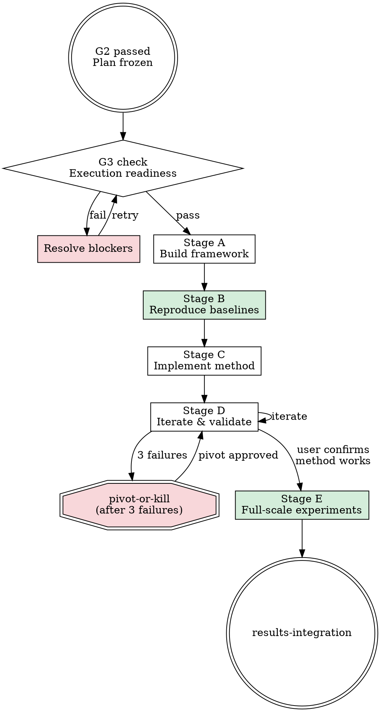

<HARD-GATE>
Do NOT begin full-scale experiments without passing G3. Smoke tests are permitted before G3.
</HARD-GATE>

# Experiment Execution (Phase 4)

## Overview

This skill orchestrates all implementation and experimentation. It branches by research type, enforces baseline-first discipline, and integrates subagents for coding, methodology review, and reproducibility verification.

## Global Constraints

Inject ALL of these into every subagent dispatch during Phase 4:

1. **VALUE_ANCHOR**: "This project's value proposition is: [read `value_proposition` from `docs/01_intake/research-anchor.yaml`]. All work serves this."
2. **METRIC_LOCK**: "Primary metrics are [read `primary_metrics` from `docs/03_plan/evaluation-protocol.yaml`]. IMMUTABLE without user permission."
3. **VENUE_ALIGNMENT**: "Target venue: [read `target_venue.primary` from `research-anchor.yaml`]. Is current experiment scale adequate?"
4. **ANTI_CHERRY_PICK**: "All seeds. All results. All failures recorded."
5. **PREMATURE_EXPERIMENT_GUARD**: "Baselines must be reproduced before running own method at full scale."

## G3 Gate Checklist — Execution Readiness

Before entering Stage A, verify ALL items:

- [ ] Data arrived and validated (`docs/04_data_resource/data-quality-report.md` exists)
- [ ] [ML] Leakage audit passed (`docs/04_data_resource/leakage-audit.md` clean)
- [ ] Resources confirmed sufficient (compute matches `research-anchor.yaml` `resources.compute`)
- [ ] Tool chain ready (environment reproducible, dependencies pinned)
- [ ] Baseline implementation plan confirmed (sources listed in `evaluation-protocol.yaml`)

If ANY item fails, STOP and resolve before proceeding.

## Execution Flow



---

## Type M Execution Flow

### Stage A — Build Experiment Framework

Set up the infrastructure before any experiment runs:

1. Data loading pipeline (scripted, deterministic)
2. Evaluation function matching `evaluation-protocol.yaml` exactly
3. Logging framework (metrics, configs, seeds, timestamps)
4. Reproducibility scaffolding: seed control, environment snapshot, config saving

Use `implementer-prompt.md` to dispatch coding tasks.

### Stage B — Reproduce Baselines

**IRON LAW: BASELINES FIRST. NO EXCEPTIONS.**

**B.1 — Check for pre-computed results**

Before implementing anything, read `evaluation-protocol.yaml` and check each baseline's `pre_computed.status`:

| Status | Action |
|--------|--------|
| `accepted` | **Skip re-running.** Import pre-computed results directly into `baseline-results.md`. Verify the numbers match what was recorded. |
| `reference_only` | **Must re-run** under our evaluation protocol. Use pre-computed results as a sanity check — our reproduced numbers should be in the same ballpark. |
| `incompatible` | **Must re-run** from scratch. Pre-computed results are discarded for official comparison. |
| *(empty)* | **Must run** — no pre-computed results available. |

Report to user:
```
Baseline execution plan:
  Skip (pre-computed accepted): N baselines
  Re-run (reference only / incompatible / new): M baselines
  Total baselines: N + M
```

**B.2 — Run baselines that need running**

For each baseline that needs running:
1. Implement or integrate from official source
2. Run with ALL seeds from `evaluation-protocol.yaml`
3. Compare with paper-reported values (or `reference_only` pre-computed values)

| Discrepancy vs reference | Action |
|--------------------------|--------|
| ≤ 1% relative | Acceptable. Proceed. |
| 1–5% relative | Investigate. Document reason. Proceed if justified. |
| > 5% relative | STOP. Debug until resolved or user approves deviation. |

**B.3 — Consolidate all baseline results**

Merge accepted pre-computed results and newly reproduced results into a single table in `docs/05_execution/baseline-results.md`:

| Baseline | Source | Dataset | Primary Metric | Seeds | Notes |
|----------|--------|---------|---------------|-------|-------|
| Method A | `accepted` pre-computed (user's own run) | X | 0.87 ± 0.02 | 5 | Imported from Phase 1 |
| Method B | reproduced (official repo) | X | 0.83 ± 0.01 | 5 | Matched paper within 0.5% |

All downstream comparisons (Stage D, Stage E) use this consolidated table.

### Stage C — Implement Core Method

Build incrementally — each component must be independently testable:
1. Implement smallest viable version first
2. Unit test each module
3. Follow `reproducibility-driven-research`: fix seeds, log environment, script everything
4. Commit after each working component

### Stage D — Initial Experiments + Iteration

<IRON-LAW>
RUN TO COMPLETION. Every method must execute its full intended procedure before results can be reported. Partial execution results are NOT valid experimental results — they are at best smoke tests. What "full execution" means depends on the method type:

- **Iterative optimization (deep learning, gradient descent)**: Train until convergence — validation metric stops improving for a patience window (defined in `evaluation-protocol.yaml` `training_convergence` section). 1-epoch or few-epoch results are NOT experiments.
- **Non-iterative ML (random forest, SVM, KNN, etc.)**: Fit with the full training set and intended hyperparameters. A quick test on a tiny subset is NOT a final run.
- **Simulation / optimization**: Run until the convergence criterion defined in the experiment plan is satisfied (e.g., objective stabilizes, residual below threshold).
- **Statistical analysis / pipeline**: Execute the complete analysis pipeline as designed. Partial pipeline outputs are intermediate, not results.

Reporting incomplete execution as final results is FORBIDDEN.
</IRON-LAW>

**Small-scale validation first.** Do NOT run full experiments immediately.

1. Run on 1 dataset at reduced scale — but the method itself must still run to completion (e.g., train to convergence for DL, full fit for ML, full pipeline for analysis)
2. Compare with baselines from Stage B on the SAME dataset with the SAME execution regime
3. If improvement → expand to more datasets
4. If no improvement → enter the **Mandatory Iteration Loop** below

#### Mandatory Iteration Loop (Type M)

<IRON-LAW>
MINIMUM 3 ITERATION ROUNDS before declaring a method "doesn't work." Each round must follow the diagnose-hypothesize-fix-measure cycle below. Random changes without analysis are NOT iterations — they are noise.
</IRON-LAW>

For each iteration round:

| Step | Action | Output |
|------|--------|--------|
| 1. Diagnose | Analyze WHERE the method fails — error analysis, confusion matrices, loss curves, per-class/per-sample breakdown | Specific failure pattern |
| 2. Hypothesize | State WHY based on diagnosis. One hypothesis per round. | Written hypothesis |
| 3. Fix | Make ONE targeted change addressing the hypothesis | Code change + rationale |
| 4. Measure | Run method to completion, evaluate on ALL seeds, compare to previous round AND baselines | Updated results table |
| 5. Report | Present to user: "Round N: changed X because Y. Result: Z vs previous W vs baseline V." | User acknowledgment |

After each round, present this comparison to the user:

```
=== Iteration Round N Report ===
Hypothesis: [what was wrong]
Change: [what was modified]
Result:
  This round:  XX.X ± Y.Y (primary metric)
  Last round:  XX.X ± Y.Y
  Best baseline: ZZ.Z ± W.W
  Gap to best baseline: ±N.N%
Status: [improving / stagnating / regressing]
Recommendation: [continue iterating / ready for full-scale / consider pivot]
```

**User must acknowledge each report before the next round begins.**

#### Minimum Performance Bar

Before moving from Stage D to Stage E, the method MUST satisfy:

- **Hard minimum**: Performance within 80% of the best baseline on primary metric (e.g., if baseline is 0.95 accuracy, method must reach at least 0.76)
- **Expected**: Method matches or exceeds at least one baseline on primary metric

If the method is **drastically worse** than all baselines (e.g., 0.42 vs 0.95):
1. This signals a fundamental problem, not a tuning issue
2. Do NOT proceed to Stage E
3. Do NOT proceed to results integration
4. Diagnose: did the method run to completion? Is there a bug? Are hyperparameters reasonable? Is the approach fundamentally flawed?
5. If 3 full iteration rounds fail to close the gap → trigger `pivot-or-kill`

**After 3 consecutive failures → trigger `pivot-or-kill`.** No fourth attempt without user decision.

### Stage E — Full-Scale Experiments

Enter ONLY after user explicitly confirms the method works at small scale AND the minimum performance bar is met.

Run the complete experiment matrix:

1. **All datasets × all methods × all seeds** from `evaluation-protocol.yaml`
2. **Ablation study** per `docs/03_plan/ablation-design.md`
3. **Parameter sensitivity** for key hyperparameters
4. **Efficiency analysis** (runtime, memory, parameter count)
5. **Domain-specific pitfall checks:**

| Domain | Pitfall Checks |
|--------|---------------|
| ML | Overfitting (train vs test gap), data leakage, label noise sensitivity |
| Bioinformatics | Batch effects, sequence length bias, homology leakage |
| Physics | Conservation law violations, symmetry breaking, unit consistency |
| Chemistry | Energy conservation, chirality handling, force field artifacts |

Dispatch `methodology-reviewer-prompt.md` after Stage E completes.
Dispatch `reproducibility-reviewer-prompt.md` before declaring results final.

---

## Type D Execution Flow

### Stage A — Data Preprocessing + Quality Control

All preprocessing must be scripted and reproducible:
1. Raw data → processed data pipeline (raw data NEVER modified)
2. Quality control report with statistics
3. Missing data, outlier, and distribution analysis
4. Document every preprocessing decision

### Stage B — Execute Analysis Framework

Follow the analysis framework from Phase 3, in order:

1. **Descriptive statistics** — distributions, summaries, initial visualizations
2. **Main analysis** — hypothesis testing or primary modeling
3. **Mechanism exploration** — why does the pattern exist?
4. **Robustness checks** — sensitivity, subgroups, alternative specifications
5. **Exploratory analysis** — unexpected patterns

For each step:
- Generate figures — **invoke `amplify:figure-quality-standards`** for every figure. Apply the style template and method-color mapping from the first figure onward.
- Self-check: "Are these results reasonable given domain knowledge?"
- Record in `docs/05_execution/experiment-log.md`

### Stage C — Alternative Hypothesis Exclusion

**REQUIRED SUB-SKILL:** Invoke `alternative-hypothesis-check` if available.

For each main finding, systematically rule out alternative explanations identified in Phase 3 (`docs/03_plan/analysis-storyboard.md`). Document evidence for and against each alternative.

### Stage D — Sufficiency Self-Check

Verify against Phase 3 sufficiency criteria:

- [ ] Data explored from multiple angles?
- [ ] Main hypothesis tested from multiple perspectives?
- [ ] Exploratory analysis completed for unexpected patterns?
- [ ] All analyses connect back to story line?
- [ ] Statistical support sufficient for each claim?
- [ ] Confounders identified and addressed?
- [ ] At least 4–6 content points with figures/tables?

If any item fails, return to the relevant stage before declaring Phase 4 complete.

---

## Subagent Integration

Use the **Task tool** to dispatch subagents for discrete implementation tasks (coding, running experiments, generating figures). Each subagent gets a focused task with clear constraints.

### How to dispatch

Use prompt templates in this skill's directory. Fill in all bracketed fields, then call the Task tool:

```
Call Task tool with:
  description: "[short task name]"
  prompt: |
    [Contents of the filled-in prompt template]
  subagent_type: "generalPurpose"
```

### Prompt templates (all in this skill's directory)

| Template | When to dispatch | What it checks |
|----------|-----------------|---------------|
| `implementer-prompt.md` | Each coding/experiment task | Implements, runs to completion, records results |
| `experiment-spec-reviewer-prompt.md` | After each implementation | Did it do what was planned? Are results from complete runs? All seeds ran? |
| `methodology-reviewer-prompt.md` | After Stage B (baselines) and Stage E (full experiments) | Statistical rigor, baseline fairness, data integrity |
| `reproducibility-reviewer-prompt.md` | Once, before declaring Phase 4 complete | Can a third party reproduce everything? |

### Review loop per task

1. **Dispatch implementer** (Task tool) → implementer reports back with results
2. **Dispatch spec reviewer** (Task tool) → check completeness and compliance
3. If spec reviewer finds issues → dispatch implementer again with fix instructions → dispatch spec reviewer again
4. After major milestones (baselines done, full experiments done) → **dispatch methodology reviewer** (Task tool, using `methodology-reviewer` agent)
5. After ALL tasks done → **dispatch reproducibility reviewer** (Task tool, using `reproducibility-reviewer` agent)

### Parallel dispatch within a stage

For truly independent tasks within the same stage (e.g., 3 independent baselines), call multiple Task tools in the **same message**:

```
Call Task tool with:
  description: "Run baseline: GraphSAGE"
  prompt: |
    [Filled implementer-prompt.md for GraphSAGE]
  subagent_type: "generalPurpose"

Call Task tool with:
  description: "Run baseline: GAT"
  prompt: |
    [Filled implementer-prompt.md for GAT]
  subagent_type: "generalPurpose"

Call Task tool with:
  description: "Run baseline: GIN"
  prompt: |
    [Filled implementer-prompt.md for GIN]
  subagent_type: "generalPurpose"
```

**Important:** Research stages (A→B→C→D→E) are strongly interdependent. Do NOT dispatch multiple stages in parallel. Run them sequentially, with review gates between major milestones. Only use parallel dispatch for independent work **within** a stage.

## Red Flags — STOP

- Running full-scale experiments before baselines are reproduced
- Skipping small-scale validation and going straight to full experiments
- Attempting a 4th iteration after 3 consecutive failures without user consultation
- Changing primary metrics mid-experiment without user authorization
- Reporting partial seed results as complete
- Running own method with better hyperparameter budget than baselines

## Rationalization Prevention

| Excuse | Reality |
|--------|---------|
| "Baselines are slow, let me skip to my method" | Baselines first. No exceptions. Skipping guarantees unfair comparison. |
| "One seed is enough for now" | One seed is noise, not signal. Run all seeds or don't report. |
| "Let me try a completely different approach" | Analyze what failed first. Random pivots waste everything learned. |
| "Full-scale is the only real test" | Small-scale catches fatal flaws cheaply. Full-scale confirms, not discovers. |
| "The baseline paper used different settings" | Match their settings first. Then run your settings. Report both. |
| "Negative results slow us down" | Negative results are data. Record them. They prevent repeating mistakes. |

## Checklist

1. Verify G3 gate checklist passes
2. Branch to correct execution flow (Type M / Type D)
3. Complete all stages in order — no skipping
4. Dispatch methodology review after experiments
5. Dispatch reproducibility review before declaring results final
6. Record everything in `docs/05_execution/`
