<HARD-GATE>
Do NOT begin full-scale experiments without passing G3. Smoke tests are permitted before G3.
</HARD-GATE>

# Experiment Execution (Phase 4)

## Overview

This skill orchestrates all implementation and experimentation. It operates in TWO stages:

- **Phase 4a (Exploratory)**: Quick, focused exploration to validate assumptions and discover insights BEFORE committing to full-scale execution. This stage may reveal that the research question or method design needs refinement.
- **Phase 4b (Full Execution)**: Complete, rigorous execution of the (possibly refined) plan.

This two-stage model reflects how real research works: you don't know everything before you start, and early exploration often reshapes the direction.

## On-Demand Literature Search (Active Throughout Phase 4)

Literature retrieval is NOT limited to Phase 1. During experiment execution, when you encounter unexpected results, need to understand a technique, or want to compare with a method not in the original literature review — **search immediately.** Use web search, arXiv, Google Scholar. Add new papers to `docs/02_literature/paper-list.md` with tag `[Found during Phase 4]`.

**If search fails or returns insufficient results:**
1. Try alternative search terms (synonyms, broader/narrower scope, different field terminology)
2. If still insufficient → note what was searched and what's missing in `docs/02_literature/paper-list.md`
3. Ask the user: "I need papers on [topic] but couldn't find them via [methods tried]. Can you point me to relevant work?"
4. Do NOT block on literature — proceed with available information and mark the gap as `[literature pending]`

## Global Constraints

Inject ALL of these into every subagent dispatch during Phase 4:

1. **VALUE_ANCHOR**: "This project's value proposition is: [read `value_proposition` from `docs/01_intake/research-anchor.yaml`]. All work serves this."
2. **METRIC_LOCK**: "Primary metrics are [read `primary_metrics` from `docs/03_plan/evaluation-protocol.yaml`]. IMMUTABLE without user permission."
3. **VENUE_ALIGNMENT**: "Target venue: [read `target_venue.primary` from `research-anchor.yaml`]. Is current experiment scale adequate?"
4. **ANTI_CHERRY_PICK**: "All seeds. All results. All failures recorded."
5. **PREMATURE_EXPERIMENT_GUARD**: "Baselines must be reproduced before running own method at full scale."

## G3 Gate Checklist — Execution Readiness

Before entering Phase 4a, verify ALL items:

- [ ] Data arrived and validated (`docs/04_data_resource/data-quality-report.md` exists)
- [ ] [ML] Leakage audit passed (`docs/04_data_resource/leakage-audit.md` clean)
- [ ] Resources confirmed sufficient (compute matches `research-anchor.yaml` `resources.compute`)
- [ ] Tool chain ready (environment reproducible, dependencies pinned)
- [ ] Baseline implementation plan confirmed (sources listed in `evaluation-protocol.yaml`)

If ANY item fails, STOP and resolve before proceeding.

## Execution Flow (Two-Stage)

```dot
digraph execution {
    rankdir=TB;
    g2 [label="G2 passed\nPlan frozen" shape=doublecircle];
    g3 [label="G3 check\nExecution readiness" shape=diamond];
    g3_fail [label="Resolve blockers" shape=box style=filled fillcolor="#f8d7da"];
    
    subgraph cluster_4a {
        label="Phase 4a — Exploratory";
        style=dashed;
        color=blue;
        exp_M [label="Type M: Run 1-2 baselines\n+ error analysis" shape=box style=filled fillcolor="#e0e0ff"];
        exp_D [label="Type D: Exploratory data analysis\n+ pattern discovery" shape=box style=filled fillcolor="#cce5ff"];
        exp_T [label="(Optional) Theoretical\nanalysis / proof sketch" shape=box style=filled fillcolor="#f0e0ff"];
    }
    
    decision [label="Decision Point:\nDoes plan still\nmake sense?" shape=diamond style=filled fillcolor="#fff3cd"];
    return_p2 [label="Return to Phase 2\n(refine question)" shape=box style=filled fillcolor="#ffcccc"];
    return_p3 [label="Return to Phase 3\n(refine design)" shape=box style=filled fillcolor="#ffcccc"];
    adjust [label="Adjust plan\n+ continue" shape=box style=filled fillcolor="#ffffcc"];
    
    subgraph cluster_4b {
        label="Phase 4b — Full Execution";
        style=dashed;
        color=green;
        A [label="Stage A\nBuild framework" shape=box];
        B [label="Stage B\nReproduce baselines" shape=box style=filled fillcolor="#d4edda"];
        C [label="Stage C\nImplement method\n(+ optional proofs)" shape=box];
        D [label="Stage D\nIterate & validate" shape=box];
        pivot [label="pivot-or-kill\n(after 3 failures)" shape=doubleoctagon style=filled fillcolor="#f8d7da"];
        E [label="Stage E\nFull-scale experiments" shape=box style=filled fillcolor="#d4edda"];
    }
    
    results [label="Phase 5:\nresults-integration" shape=doublecircle];

    g2 -> g3;
    g3 -> g3_fail [label="fail"];
    g3_fail -> g3 [label="retry"];
    g3 -> exp_M [label="pass\nType M"];
    g3 -> exp_D [label="pass\nType D"];
    exp_M -> exp_T [label="has theory?"];
    exp_D -> exp_T [label="has theory?"];
    exp_M -> decision;
    exp_D -> decision;
    exp_T -> decision;
    
    decision -> return_p2 [label="question\nwrong"];
    decision -> return_p3 [label="design\nneeds change"];
    decision -> adjust [label="minor\nadjustment"];
    decision -> A [label="plan\nconfirmed"];
    adjust -> A;
    
    A -> B;
    B -> C;
    C -> D;
    D -> D [label="iterate"];
    D -> pivot [label="3 failures"];
    pivot -> D [label="pivot approved"];
    D -> E [label="user confirms\nmethod works"];
    E -> results;
}
```



---

## Phase 4a — Exploratory Stage

<IRON-LAW>
Phase 4a is NOT optional. Before committing to full-scale execution, you MUST do a focused exploration to validate that the plan from Phase 3 is sound. This catches fundamental problems BEFORE weeks of computation are wasted.

Phase 4a is deliberately QUICK — it should take a fraction of the effort of full execution. The goal is insight, not completeness.
</IRON-LAW>

### Phase 4a for Type M — Baseline Probing + Initial Assessment

**Goal:** Understand the actual problem landscape before committing to full-scale execution.

NOTE: Baselines run here count toward Phase 4b Stage B — they will NOT be re-run. Phase 4a is a subset of the full execution, not a separate exercise.

1. **Set up minimal infrastructure** — data loading, evaluation function, seed control
2. **Run 1-2 strongest baselines** on 1 representative dataset, full execution (not toy run)
3. **Analyze baseline results:**
   - What's the actual performance level? Does it match literature?
   - Where do baselines fail? (error analysis, failure cases, edge cases)
   - Is there a systematic failure pattern? Is it what we predicted in Phase 3?
4. **Quick prototype of our method** (optional but recommended) — run a minimal version to see if the core idea shows promise
5. **Quick literature check** if findings are surprising

**Output:** `docs/05_execution/phase4a-exploration-report.md`

```
Phase 4a Exploration Report (Type M):
═════════════════════════════════════

Baselines run: [list with results]

Error analysis findings:
  [describe failure patterns, edge cases, systematic issues]

Predicted failure pattern (from Phase 3): [X]
Actual failure pattern: [Y]
Alignment: [matched / partially matched / different]

Quick prototype results (if run): [summary]

Issues or surprises: [list anything unexpected]
```

### Phase 4a for Type D — Preliminary Analysis Run

**Goal:** Run the core analysis pipeline once on real data to see what the actual results look like, before committing to the full analysis plan.

NOTE: "Exploratory analysis" means different things in different fields. It is NOT limited to clustering and dimensionality reduction. The point is to execute the main planned analysis at a basic level and examine the output.

1. **Preprocessing** — quality control, normalization, whatever the domain requires
2. **Run the core analysis pipeline once** — whatever the Phase 3 plan calls for as the main analysis (could be differential expression, could be model fitting, could be statistical tests, could be simulation — depends on the field)
3. **Examine the results:**
   - Do the results make sense given domain knowledge?
   - Are the expected signals present?
   - Is there something unexpected or interesting?
   - Is the data quality sufficient for the planned analysis?
4. **Assess the analysis plan:**
   - Does the Phase 3 plan still make sense given what we see?
   - Are some planned analyses unnecessary? Are there gaps?

**Output:** `docs/05_execution/phase4a-exploration-report.md`

```
Phase 4a Exploration Report (Type D):
═════════════════════════════════════

Data quality: [summary]

Preliminary analysis results:
  [describe key outputs from the initial analysis run]

Results vs expectations:
  Expected: [what Phase 3 predicted]
  Observed: [what actually came out]
  Surprises: [anything unexpected]

Assessment of analysis plan:
  Still appropriate? [yes / needs adjustment]
  Missing analyses? [list]
  Unnecessary analyses? [list]
```

### Phase 4a for Type C — Quick Benchmark Probe

**Goal:** Run a quick comparison on one benchmark to see if the tool's advantages are real.

1. **Run our tool + 1-2 main competitors** on 1 representative benchmark
2. **Compare**: correctness, speed, memory
3. **Assess**: Does our claimed advantage hold? How big is the gap?
4. **Test installation**: Does it install cleanly on a fresh environment?

**Output:** Append to `docs/05_execution/phase4a-exploration-report.md`

```
Phase 4a Exploration Report (Type C):
═════════════════════════════════════

Quick benchmark: [name]
Our tool: [correctness, runtime, memory]
Competitor A: [correctness, runtime, memory]
Competitor B: [correctness, runtime, memory]

Claimed advantage: [X]
Actual advantage: [Y]
Gap: [large / moderate / marginal / none]

Installation test: [clean / issues]
```

### Phase 4a — Optional: Theoretical Analysis / Proof Sketch

If the project includes theoretical claims (convergence, complexity, correctness, bounds):

1. **Sketch the proof strategy** — identify the key lemmas needed
2. **Attempt the easiest lemma first** — to check if the overall approach is viable
3. **Identify blockers** — are there steps that require assumptions we can't justify?
4. **Assess feasibility** — can we prove what we claimed, or do we need to weaken the claim?

This can run in parallel with the computational exploration above.

**Output:** Append to `docs/05_execution/phase4a-exploration-report.md`

```
Theoretical Analysis (preliminary):
  Claim: [what we want to prove]
  Proof strategy: [approach]
  Key lemma attempted: [which one, result]
  Feasibility: [viable / needs weaker claim / blocked by X]
```

### ⛔ Phase 4a Decision Point (MANDATORY STOP)

<IRON-LAW>
After Phase 4a, you MUST present the exploration report to the user and STOP. The user decides what to do next. Do NOT automatically proceed to Phase 4b.
</IRON-LAW>

Based on the exploration results, assess the situation and present appropriate options. The most common outcome is **local adjustment**, not a full phase reset.

```
Phase 4a exploration complete. Report above.

MY ASSESSMENT: [summarize what was found and what it means for the plan]

YOUR OPTIONS:

1. ✅ PROCEED AS-IS — Plan is confirmed. Continue to Phase 4b.

2. 🔧 LOCAL ADJUSTMENT (most common) — Adjust specific parts of the 
   plan based on what we learned:
   [list specific proposed changes, e.g.:]
   - Add experiment X to address [finding]
   - Modify analysis step Y because [reason]
   - Replace baseline Z with a stronger one
   - Adjust method component W based on error analysis
   These changes are applied directly — no need to redo Phase 3.

3. 🔄 FOCUSED RE-DISCUSSION — Some findings need deeper thought. I'll 
   dispatch the Phase 3 agents (Innovation Advisor / Domain Scientist / etc.)
   for a FOCUSED discussion on the specific issue:
   "[describe the specific issue that needs multi-agent input]"
   This is NOT a full Phase 3 redo — just a targeted consultation.

4. ↩️ RETURN TO PHASE 3 — The method/analysis design has a FUNDAMENTAL 
   problem that can't be fixed with local adjustments.
   [Only suggest this if there's a deep structural issue.]

5. ↩️↩️ RETURN TO PHASE 2 — The research question itself is wrong.
   [Only suggest this in extreme cases — e.g., the data contradicts 
   the premise, or the problem doesn't exist.]

Which option? (You can also propose your own adjustments.)
```

**Guidelines for which option to suggest:**

| Situation | Recommended Option |
|-----------|-------------------|
| Results match predictions, plan looks good | 1 (Proceed) |
| Baseline stronger/weaker than expected, need to add/change experiments | 2 (Local Adjustment) |
| Error analysis reveals a different bottleneck than predicted | 2 or 3 (Adjust or Re-discuss) |
| Data shows unexpected pattern worth exploring | 2 (Add experiments to explore it) |
| Method's core idea doesn't address the actual problem | 3 or 4 (Re-discuss or Return) |
| Data doesn't support the research question at all | 5 (Return to Phase 2) |

**For Option 2 (Local Adjustment):**
- Apply the changes directly to Phase 3 outputs (evaluation protocol, analysis plan, etc.)
- Document what changed and why in the exploration report
- Proceed to Phase 4b with the updated plan

**For Option 3 (Focused Re-discussion):**
- Dispatch the relevant Phase 3 agents with the Phase 4a findings
- Give them a FOCUSED prompt: "Based on these exploration results, should we [specific question]?"
- Agents see the exploration report + the original plan
- Apply their recommendations and proceed to Phase 4b
- This is a LIGHTWEIGHT version of the Phase 3 deliberation — max 2-3 rounds, focused on one issue

**For Options 4 and 5 (Full return):**
- Save exploration findings in `docs/05_execution/phase4a-exploration-report.md`
- Return to the appropriate phase via its "Re-entry from Phase 4a" path
- Carry forward all exploration insights

**The user can also iterate within Phase 4a:**
If the user says "try X first" or "run one more experiment before deciding," that's fine — Phase 4a can have multiple rounds of quick exploration before the decision point. The MANDATORY STOP is about getting user input before committing to full-scale Phase 4b, not about limiting exploration.

---

## Phase 4b — Full Execution

---

## Type M Execution Flow (Phase 4b)

### Stage A — Build Experiment Framework

Set up the infrastructure before any experiment runs:

1. Data loading pipeline (scripted, deterministic)
2. Evaluation function matching `evaluation-protocol.yaml` exactly
3. Logging framework (metrics, configs, seeds, timestamps)
4. Reproducibility scaffolding: seed control, environment snapshot, config saving

Use `implementer-prompt.md` to dispatch coding tasks.

### Stage B — Complete Baseline Reproduction

**IRON LAW: BASELINES FIRST. NO EXCEPTIONS.**

NOTE: If Phase 4a already ran some baselines, carry those results forward — do NOT re-run them. Stage B completes the REMAINING baselines and consolidates all results.

**B.1 — Check for pre-computed and Phase 4a results**

Before implementing anything, check two sources:
1. `evaluation-protocol.yaml` — each baseline's `pre_computed.status`
2. `docs/05_execution/phase4a-exploration-report.md` — baselines already run in Phase 4a

| Status | Action |
|--------|--------|
| `accepted` | **Skip re-running.** Import pre-computed results directly into `baseline-results.md`. Verify the numbers match what was recorded. |
| `reference_only` | **Must re-run** under our evaluation protocol. Use pre-computed results as a sanity check — our reproduced numbers should be in the same ballpark. |
| `incompatible` | **Must re-run** from scratch. Pre-computed results are discarded for official comparison. |
| *(empty)* | **Must run** — no pre-computed results available. |

Report to user:
```
Baseline execution plan:
  Skip (pre-computed accepted): N baselines
  Re-run (reference only / incompatible / new): M baselines
  Total baselines: N + M
```

**B.2 — Run baselines that need running**

For each baseline that needs running:
1. Implement or integrate from official source
2. Run with ALL seeds from `evaluation-protocol.yaml`
3. Compare with paper-reported values (or `reference_only` pre-computed values)

| Discrepancy vs reference | Action |
|--------------------------|--------|
| ≤ 1% relative | Acceptable. Proceed. |
| 1–5% relative | Investigate. Document reason. Proceed if justified. |
| > 5% relative | STOP. Debug until resolved or user approves deviation. |

**B.3 — Consolidate all baseline results**

Merge accepted pre-computed results and newly reproduced results into a single table in `docs/05_execution/baseline-results.md`:

| Baseline | Source | Dataset | Primary Metric | Seeds | Notes |
|----------|--------|---------|---------------|-------|-------|
| Method A | `accepted` pre-computed (user's own run) | X | 0.87 ± 0.02 | 5 | Imported from Phase 1 |
| Method B | reproduced (official repo) | X | 0.83 ± 0.01 | 5 | Matched paper within 0.5% |

All downstream comparisons (Stage D, Stage E) use this consolidated table.

### Stage C — Implement Core Method (+ Optional Theoretical Analysis)

Build incrementally — each component must be independently testable:
1. Implement smallest viable version first
2. Unit test each module
3. Follow `reproducibility-driven-research`: fix seeds, log environment, script everything
4. Commit after each working component

**If the project includes theoretical claims** (convergence, complexity, correctness):

Complete the formal proofs alongside or before full experimental validation:

1. **State theorems formally** — precise conditions, claims, and notation
2. **Prove each theorem** — show complete derivations, not hand-waving
3. **Verify assumptions** — ensure the conditions required by the proof hold in practice
4. **Connect theory to experiments** — the experiments should validate what the theory predicts

Write proofs to `docs/05_execution/theoretical-analysis.md` (or `.tex` for LaTeX).

**Common proof types in computational research:**

| Type | Example | What to Show |
|------|---------|-------------|
| Convergence | "Our optimizer converges to a stationary point" | Rate and conditions |
| Complexity | "Algorithm runs in O(n log n) time" | Tight bound with proof |
| Correctness | "Output satisfies property P" | Formal proof, possibly by induction |
| Approximation | "Solution is within factor α of optimal" | Bound with construction |
| Generalization | "Test error bounded by X with probability Y" | PAC/VC/Rademacher bound |

If a proof attempt FAILS (can't prove the desired result):
- Document what went wrong — is the claim too strong?
- Consider weakening the theorem (e.g., weaker conditions, looser bound)
- Discuss with user: proceed with weaker theoretical guarantee, or redesign the method?

### Stage D — Initial Experiments + Iteration

<IRON-LAW>
RUN TO COMPLETION. Every method must execute its full intended procedure before results can be reported. Partial execution results are NOT valid experimental results — they are at best smoke tests. What "full execution" means depends on the method type:

- **Iterative optimization (deep learning, gradient descent)**: Train until convergence — validation metric stops improving for a patience window (defined in `evaluation-protocol.yaml` `training_convergence` section). 1-epoch or few-epoch results are NOT experiments.
- **Non-iterative ML (random forest, SVM, KNN, etc.)**: Fit with the full training set and intended hyperparameters. A quick test on a tiny subset is NOT a final run.
- **Simulation / optimization**: Run until the convergence criterion defined in the experiment plan is satisfied (e.g., objective stabilizes, residual below threshold).
- **Statistical analysis / pipeline**: Execute the complete analysis pipeline as designed. Partial pipeline outputs are intermediate, not results.

Reporting incomplete execution as final results is FORBIDDEN.
</IRON-LAW>

**Small-scale validation first.** Do NOT run full experiments immediately.

1. Run on 1 dataset at reduced scale — but the method itself must still run to completion (e.g., train to convergence for DL, full fit for ML, full pipeline for analysis)
2. Compare with baselines from Stage B on the SAME dataset with the SAME execution regime
3. If improvement → expand to more datasets
4. If no improvement → enter the **Mandatory Iteration Loop** below

#### Mandatory Iteration Loop (Type M)

<IRON-LAW>
MINIMUM 3 ITERATION ROUNDS before declaring a method "doesn't work." Each round must follow the diagnose-hypothesize-fix-measure cycle below. Random changes without analysis are NOT iterations — they are noise.
</IRON-LAW>

For each iteration round:

| Step | Action | Output |
|------|--------|--------|
| 1. Diagnose | Analyze WHERE the method fails — error analysis, confusion matrices, loss curves, per-class/per-sample breakdown | Specific failure pattern |
| 2. Hypothesize | State WHY based on diagnosis. One hypothesis per round. | Written hypothesis |
| 3. Fix | Make ONE targeted change addressing the hypothesis | Code change + rationale |
| 4. Measure | Run method to completion, evaluate on ALL seeds, compare to previous round AND baselines | Updated results table |
| 5. Report | Present to user: "Round N: changed X because Y. Result: Z vs previous W vs baseline V." | User acknowledgment |

After each round, present this comparison to the user:

```
=== Iteration Round N Report ===
Hypothesis: [what was wrong]
Change: [what was modified]
Result:
  This round:  XX.X ± Y.Y (primary metric)
  Last round:  XX.X ± Y.Y
  Best baseline: ZZ.Z ± W.W
  Gap to best baseline: ±N.N%
Status: [improving / stagnating / regressing]
Recommendation: [continue iterating / ready for full-scale / consider pivot]
```

**User must acknowledge each report before the next round begins.**

#### Minimum Performance Bar

Before moving from Stage D to Stage E, the method MUST satisfy:

- **Hard minimum**: Performance within 80% of the best baseline on primary metric (e.g., if baseline is 0.95 accuracy, method must reach at least 0.76)
- **Expected**: Method matches or exceeds at least one baseline on primary metric

If the method is **drastically worse** than all baselines (e.g., 0.42 vs 0.95):
1. This signals a fundamental problem, not a tuning issue
2. Do NOT proceed to Stage E
3. Do NOT proceed to results integration
4. Diagnose: did the method run to completion? Is there a bug? Are hyperparameters reasonable? Is the approach fundamentally flawed?
5. If 3 full iteration rounds fail to close the gap → trigger `pivot-or-kill`

**After 3 consecutive failures → trigger `pivot-or-kill`.** No fourth attempt without user decision.

### Stage E — Full-Scale Experiments

Enter ONLY after user explicitly confirms the method works at small scale AND the minimum performance bar is met.

Run the complete experiment matrix:

1. **All datasets × all methods × all seeds** from `evaluation-protocol.yaml`
2. **Ablation study** per `docs/03_plan/ablation-design.md`
3. **Parameter sensitivity** for key hyperparameters
4. **Efficiency analysis** (runtime, memory, parameter count)
5. **Domain-specific pitfall checks:**

| Domain | Pitfall Checks |
|--------|---------------|
| ML | Overfitting (train vs test gap), data leakage, label noise sensitivity |
| Bioinformatics | Batch effects, sequence length bias, homology leakage |
| Physics | Conservation law violations, symmetry breaking, unit consistency |
| Chemistry | Energy conservation, chirality handling, force field artifacts |

Dispatch `methodology-reviewer-prompt.md` after Stage E completes.
Dispatch `reproducibility-reviewer-prompt.md` before declaring results final.

---

## Type D Execution Flow (Phase 4b)

### Stage A — Data Preprocessing + Quality Control

All preprocessing must be scripted and reproducible:
1. Raw data → processed data pipeline (raw data NEVER modified)
2. Quality control report with statistics
3. Missing data, outlier, and distribution analysis
4. Document every preprocessing decision

### Stage B — Execute Analysis Framework

Follow the analysis framework from Phase 3, in order:

1. **Descriptive statistics** — distributions, summaries, initial visualizations
2. **Main analysis** — hypothesis testing or primary modeling
3. **Mechanism exploration** — why does the pattern exist?
4. **Robustness checks** — sensitivity, subgroups, alternative specifications
5. **Exploratory analysis** — unexpected patterns

For each step:
- Generate figures — **invoke `amplify:figure-quality-standards`** for every figure. Apply the style template and method-color mapping from the first figure onward.
- Self-check: "Are these results reasonable given domain knowledge?"
- Record in `docs/05_execution/experiment-log.md`

### Stage C — Alternative Hypothesis Exclusion

**REQUIRED SUB-SKILL:** Invoke `alternative-hypothesis-check` if available.

For each main finding, systematically rule out alternative explanations identified in Phase 3 (`docs/03_plan/analysis-storyboard.md`). Document evidence for and against each alternative.

### Stage D — Sufficiency Self-Check

Verify against Phase 3 sufficiency criteria:

- [ ] Data explored from multiple angles (not just one clustering/one visualization)?
- [ ] Main hypothesis tested from multiple perspectives?
- [ ] Exploratory analysis completed for unexpected patterns?
- [ ] All analyses connect back to story line?
- [ ] Statistical support sufficient for each claim?
- [ ] Confounders identified and addressed?
- [ ] At least 4–6 content points with figures/tables?
- [ ] At least 4 distinct, publication-quality figures generated?

If any item fails, return to the relevant stage before declaring Phase 4 complete.

#### Domain Sanity Check (All Types)

<IRON-LAW>
Before declaring ANY results valid, perform a **domain sanity check**: do the results make sense given basic domain knowledge? AI agents can produce technically correct but biologically/scientifically nonsensical results without noticing.

**Examples of sanity failures (catch these BEFORE presenting results):**
- PBMC analysis shows B cells at 59% and no T cells → T cells should be ~60-70% of PBMCs; this means annotations are wrong
- Gene expression analysis shows all housekeeping genes as top markers → likely a normalization problem
- Clustering produces 50 clusters from 2,700 cells → over-clustering
- All p-values are exactly 0.0 → likely a numerical issue, not real significance
- A "novel subpopulation" that contains 3 cells → too few to be reliable
- Trajectory analysis shows all cells on one branch → pseudotime may have failed

**How to check:**
1. Compare key quantitative results against known ranges from the literature
2. If a result seems surprising, verify it's genuinely novel rather than an artifact
3. If cell type proportions, effect sizes, or distributions differ dramatically from literature expectations, investigate before reporting
4. Ask: "Would a domain expert look at this result and immediately say something is wrong?"

If a sanity check fails, debug the analysis pipeline before continuing. Do NOT report suspicious results as "findings."
</IRON-LAW>

#### Type D Iteration Requirement

<IRON-LAW>
Type D projects also require iteration. "Ran analysis once and got some results" is NOT sufficient.

After initial analysis, ask yourself:
1. Are the findings interesting enough for the target venue? If not → deepen the analysis.
2. Are there sub-populations, edge cases, or unexpected patterns worth exploring? If yes → run additional analyses.
3. Does the story line from Phase 3 have gaps? If yes → fill them with additional analyses.
4. Are the figures compelling or just "we did the analysis"? If the latter → generate better visualizations.
5. **Do the results pass the domain sanity check above?** If not → debug before iterating.

Minimum: Present the user with at least 2 rounds of results before declaring Phase 4 complete. Round 1 = initial analysis. Round 2 = refined analysis addressing gaps, deepening insights, or exploring unexpected findings.
</IRON-LAW>

---

## Type C Execution Flow (Phase 4b)

### Stage A — Implementation + Testing

1. Core tool implementation (if not already done)
2. Comprehensive unit tests and integration tests
3. Edge case handling
4. Documentation: API reference, installation guide, quickstart tutorial
5. Package for distribution (pip, conda, CRAN, etc.)

### Stage B — Benchmark Against Competitors

Run ALL competing tools and our tool on the SAME benchmark suite:

1. **Correctness**: Compare outputs against reference/gold standard
2. **Performance**: Runtime and memory on standardized inputs
3. **Scalability**: Scaling curves (vary input size systematically)

Record everything in `docs/05_execution/benchmark-results.md`.

### Stage C — Real-World Case Studies

Run 2-3 real-world use cases from the target domain:
- Use realistic data, not toy examples
- Document the workflow end-to-end
- Show how the tool solves a real problem the user would have
- Generate figures showing results

### Stage D — Usability and Documentation Review

- Test installation on a clean environment
- Run the quickstart tutorial as a new user would
- Check API consistency and error messages
- Verify documentation completeness

---

## Subagent Integration

Use the **Task tool** to dispatch subagents for discrete implementation tasks (coding, running experiments, generating figures). Each subagent gets a focused task with clear constraints.

### How to dispatch

Use prompt templates in this skill's directory. Fill in all bracketed fields, then call the Task tool:

```
Call Task tool with:
  description: "[short task name]"
  prompt: |
    [Contents of the filled-in prompt template]
  subagent_type: "generalPurpose"
```

### Prompt templates (all in this skill's directory)

| Template | When to dispatch | What it checks |
|----------|-----------------|---------------|
| `implementer-prompt.md` | Each coding/experiment task | Implements, runs to completion, records results |
| `experiment-spec-reviewer-prompt.md` | After each implementation | Did it do what was planned? Are results from complete runs? All seeds ran? |
| `methodology-reviewer-prompt.md` | After Stage B (baselines) and Stage E (full experiments) | Statistical rigor, baseline fairness, data integrity |
| `reproducibility-reviewer-prompt.md` | Once, before declaring Phase 4 complete | Can a third party reproduce everything? |

### Review loop per task

1. **Dispatch implementer** (Task tool) → implementer reports back with results
2. **Dispatch spec reviewer** (Task tool) → check completeness and compliance
3. If spec reviewer finds issues → dispatch implementer again with fix instructions → dispatch spec reviewer again
4. After major milestones (baselines done, full experiments done) → **dispatch methodology reviewer** (Task tool, using `methodology-reviewer` agent)
5. After ALL tasks done → **dispatch reproducibility reviewer** (Task tool, using `reproducibility-reviewer` agent)

### Parallel dispatch within a stage

For truly independent tasks within the same stage (e.g., 3 independent baselines), call multiple Task tools in the **same message**:

```
Call Task tool with:
  description: "Run baseline: GraphSAGE"
  prompt: |
    [Filled implementer-prompt.md for GraphSAGE]
  subagent_type: "generalPurpose"

Call Task tool with:
  description: "Run baseline: GAT"
  prompt: |
    [Filled implementer-prompt.md for GAT]
  subagent_type: "generalPurpose"

Call Task tool with:
  description: "Run baseline: GIN"
  prompt: |
    [Filled implementer-prompt.md for GIN]
  subagent_type: "generalPurpose"
```

**Important:** Research stages (A→B→C→D→E) are strongly interdependent. Do NOT dispatch multiple stages in parallel. Run them sequentially, with review gates between major milestones. Only use parallel dispatch for independent work **within** a stage.

## Red Flags — STOP

- Running full-scale experiments before baselines are reproduced
- Skipping small-scale validation and going straight to full experiments
- Attempting a 4th iteration after 3 consecutive failures without user consultation
- Changing primary metrics mid-experiment without user authorization
- Reporting partial seed results as complete
- Running own method with better hyperparameter budget than baselines

## Rationalization Prevention

| Excuse | Reality |
|--------|---------|
| "Baselines are slow, let me skip to my method" | Baselines first. No exceptions. Skipping guarantees unfair comparison. |
| "One seed is enough for now" | One seed is noise, not signal. Run all seeds or don't report. |
| "Let me try a completely different approach" | Analyze what failed first. Random pivots waste everything learned. |
| "Full-scale is the only real test" | Small-scale catches fatal flaws cheaply. Full-scale confirms, not discovers. |
| "The baseline paper used different settings" | Match their settings first. Then run your settings. Report both. |
| "Negative results slow us down" | Negative results are data. Record them. They prevent repeating mistakes. |

## Checklist

1. Verify G3 gate checklist passes
2. Branch to correct execution flow (Type M / Type D)
3. Complete all stages in order — no skipping
4. Dispatch methodology review after experiments
5. Dispatch reproducibility review before declaring results final
6. Record everything in `docs/05_execution/`

---

## Re-Entry from Phase 5 (Experiment Supplement Path)

When Phase 5 (results integration) identifies missing experiments — typically flagged by the Devil's Advocate or Audience Specialist as REQUIRED supplements — the workflow returns here.

**What you receive:** A supplement request from Phase 5 specifying:
- Exactly which experiments/analyses are needed
- Why they are needed (which claim lacks evidence)
- Priority (REQUIRED vs RECOMMENDED)

**What you do:**

1. **Scope check** — Only run the requested supplements. Do NOT re-run existing experiments or re-open completed stages.
2. **Follow the same discipline** — Same seeds, same evaluation protocol, same fairness constraints. The locked protocol still applies.
3. **Record in experiment log** — Mark entries as `[Supplement from Phase 5]` in `docs/05_execution/experiment-log.md`.
4. **Domain sanity check** — Verify new results make scientific sense, same as for original experiments.
5. **Return to Phase 5** — Present supplement results to the user, then resume Phase 5 where it left off. The multi-agent discussion panel will re-evaluate with the updated results.

**Do NOT:** Re-run the entire Phase 4 pipeline. Do NOT change the evaluation protocol. Do NOT add experiments beyond what was requested without user approval.

---

## Re-Entry from Phase 6 (Paper Writing Supplement Path)

When Phase 6 (paper writing) review panel identifies that new experiments are needed — typically flagged as "EXPERIMENT NEEDED" by domain critics or adversarial reviewers — the workflow returns here.

**What you receive:** A supplement request from Phase 6 specifying:
- Which experiments/analyses are needed
- Which paper section or claim triggered the request
- Priority level

**What you do:**

1. **Same scoped approach as Phase 5 supplements** — Only run what's requested.
2. **Record as** `[Supplement from Phase 6]` in the experiment log.
3. **Domain sanity check** on new results.
4. **Return to Phase 6** — Present supplement results to the user, then resume paper writing. The affected sections will be updated with the new results, and the polishing cycle for those sections will re-run.

**Important:** If the supplement changes results significantly (e.g., new findings that alter the narrative), the argument blueprint (`argument-blueprint.md`) should be updated before resuming Phase 6.

---

<IRON-LAW>
## ⛔ MANDATORY STOP — After Phase 4 Completion

When all experiments/analyses are done, **END YOUR RESPONSE** with a results summary:

```
Phase 4 complete. Results summary:
  - [list key results, metrics, figures generated]
  - [list any issues or limitations found]

Shall I proceed to Phase 5 (Results Integration)?
This will include a multi-agent discussion panel to stress-test
the results before paper writing.
```

Do NOT invoke `results-integration` or begin organizing results in the same response.
Do NOT skip to paper writing.

**STOP. WAIT. The user must reply before you proceed.**
</IRON-LAW>
