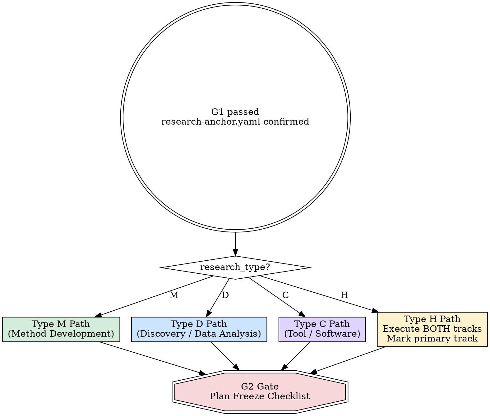

<HARD-GATE>
NO CODE BEFORE PLAN FREEZE (G2). Do NOT write implementation code, run experiments, or build pipelines until the G2 gate checklist at the end of this skill is fully satisfied and user-approved.
</HARD-GATE>

# Method & Framework Design (Phase 3)

## Overview

This is the most critical branching point in the research workflow. Type M and Type D projects follow completely different design paths. Executing the wrong path — or skipping design entirely — guarantees wasted effort.

## On-Demand Literature Search (Active Throughout Phase 3)

<IRON-LAW>
Phase 1 literature review is the STARTING POINT, not the final word. During method/framework design, you WILL encounter questions that require additional literature:

- "Has anyone tried approach X for this problem?"
- "What's the current SOTA for sub-task Y?"
- "Is there theoretical justification for design choice Z?"
- "What hyperparameters did paper W use for this baseline?"

**When this happens: SEARCH IMMEDIATELY.** Do not guess, do not rely on memory, do not defer to "we'll check later." Use web search, arXiv, Google Scholar, or any available tools to find the answer NOW.

**Update the literature record:** Any new papers found during Phase 3 should be added to `docs/02_literature/paper-list.md` with a note: `[Found during Phase 3 — method design]`.

**If search fails** (no results, paywall, or tools unavailable): do NOT fabricate an answer. Instead:
1. Note the specific question that needs answering: "Need to know: [question]"
2. Record it in the exploration report
3. Ask the user: "I couldn't find information on [X]. Do you know, or can you check?"
4. Continue with what you know, marking the gap as an assumption to verify

This applies equally to Phase 4, 5, and 6. Literature retrieval is a continuous activity, not a one-time Phase 1 task.
</IRON-LAW>

## Re-Entry from Phase 4a (Exploratory Return Path)

If the user returns to Phase 3 from Phase 4a exploration (because baseline results or data analysis revealed the method/analysis design needs rethinking), do NOT start from scratch:

1. **Read the Phase 4a exploration report** (`docs/05_execution/phase4a-exploration-report.md`)
2. **Carry forward what was learned**:
   - Type M: baseline performance, actual failure patterns (may differ from predicted), error analysis
   - Type D: data characteristics, patterns found in EDA, what analyses are/aren't promising
3. **Targeted redesign**: Only redesign the parts that the exploration revealed as problematic. If the evaluation protocol is still valid, keep it. If the innovation point needs adjustment, adjust only that.
4. **Re-run the multi-agent design deliberation** (M-Step 5 or D-Step 4) with the new context — agents should have access to the Phase 4a exploration report
5. **Update G2 outputs** — the revised plan goes through G2 checklist again before re-entering Phase 4b

## Branching Logic



Read `research_type` from `docs/01_intake/research-anchor.yaml`. If absent, STOP and invoke `domain-anchoring` first.

---

## Type M Path — Method Development

### M-Step 1: Lock Evaluation Protocol

**REQUIRED SUB-SKILL:** Invoke `amplify:evaluation-protocol-design` if available. If unavailable, follow the procedure below.

For each item, propose with justification, then get explicit user confirmation before proceeding:

1. **Primary metrics** — why these measure the core claim
2. **Evaluation protocol** — K-fold, train/val/test, episode-based, etc.
3. **Seeds** — recommend: `[42, 123, 456, 789, 1024]`
4. **Statistical reporting** — mean ± std, 95% CI, significance test
5. **Evaluation datasets** — rationale for each dataset choice

Write to `docs/03_plan/evaluation-protocol.yaml` using `templates/evaluation-protocol.yaml`. Set `locked: true` only after user confirms every item.

### M-Step 2: Design Innovation Method

Build on literature insights and cross-domain inspiration from Phase 1–2.

- **Innovation Point** (limit 1–2): state precisely what is novel
- **Value Proposition**: why this works — ground in theory or strong intuition
- **Predicted failure modes**: what could go wrong, and backup plan for each

Write `innovation_point` and `value_proposition` to `research-anchor.yaml`.

### M-Step 3: Confirm Baselines and Pre-Existing Results

**3a. Consolidate baseline list:**

1. Import `user_specified` baselines from Phase 1 (`docs/02_literature/baseline-collection.md`) → these are automatically `must_include`
2. System recommends additional baselines from literature review (target total: 3–5 for `must_include`)
3. Ask user again: *"Are there additional methods you want to compare against?"*
4. For each baseline, record:
   - Name and citation
   - Source: `official_repo` / `our_implementation` / `paper_reported`
   - Official code URL (if available)
   - Configuration notes (hyperparameters, training setup)

**3b. Check for pre-existing results:**

Ask: *"Do you already have results for any of these baselines? (e.g., from your own prior experiments, or from a standardized benchmark leaderboard)"*

If user provides pre-computed results, for each one verify:
- [ ] Which dataset(s) and split(s) were used?
- [ ] Which metrics were reported?
- [ ] How many seeds/runs? What were the seed values?
- [ ] What execution environment? (hardware, software versions)
- [ ] Source: `user_own_run` / `paper_reported` / `leaderboard`

Record in `evaluation-protocol.yaml` baselines section with a `pre_computed` field.

**Compatibility check** — once `evaluation-protocol.yaml` is drafted (M-Step 1), compare pre-computed results against the locked protocol:

| Check | Compatible | Action if incompatible |
|-------|-----------|----------------------|
| Same metric | ✅ | Use directly |
| Different metric | ❌ | Must re-run with correct metric |
| Same dataset + split | ✅ | Use directly |
| Different split | ❌ | Must re-run with correct split |
| ≥ 3 seeds | ✅ | Use directly (even if different seed values) |
| < 3 seeds or unknown | ⚠️ | Accept as reference but re-run for official comparison |
| Same execution regime (e.g., same epochs, same HP budget) | ✅ | Use directly |
| Different regime | ⚠️ | Use as reference; consider re-running for fairness |

Mark each pre-computed result as:
- `accepted` — fully compatible, no re-run needed
- `reference_only` — useful context but must re-run for official comparison
- `incompatible` — must re-run

Write to `evaluation-protocol.yaml` baselines section.

### M-Step 4: Pre-Design Ablation Experiments

For each key component of the proposed method:

| Component | Ablation Method | Expected Impact |
|-----------|----------------|-----------------|
| *(fill)* | Remove / replace / simplify | *(predicted Δ on primary metric)* |

### M-Step 4b: Theoretical Analysis Plan (Optional but Recommended)

If the proposed method makes claims that can be theoretically grounded, plan the theory work here. This is OPTIONAL — not all method papers need theory. But if the target venue values theoretical justification, this significantly strengthens the paper.

**When to include theoretical analysis:**
- The method involves a new optimization objective → prove convergence
- The method involves a new algorithm → analyze time/space complexity
- The method makes approximation claims → prove bounds
- The method has correctness requirements → prove correctness
- The target venue is theory-friendly (e.g., NeurIPS, ICML, JMLR, SIAM)

**When NOT needed:**
- Pure empirical papers at applied venues (e.g., application workshops, domain-specific conferences)
- System/tool papers where the contribution is engineering, not algorithmic
- The method is a straightforward application of existing, already-proven components

**If included, plan:**

1. **What to prove**: List specific theorems/propositions (e.g., "Theorem 1: Algorithm converges at rate O(1/√T)")
2. **Proof strategy sketch**: What mathematical tools will you use? (e.g., Lyapunov analysis, VC theory, concentration inequalities)
3. **Required assumptions**: What conditions must hold? Are they realistic?
4. **Fallback**: If the proof doesn't work, what weaker result would still be valuable?

Record in `docs/03_plan/theoretical-analysis-plan.md`.

### M-Step 5: Multi-Agent Method Design Deliberation (AUTOMATED — MANDATORY)

<IRON-LAW>
For Type M, the method design determines whether the paper will be a genuine contribution or a trivial variation. A single agent designing a method has inherent blind spots — it may overestimate novelty, underestimate baselines, or miss simpler alternatives. Multi-agent deliberation catches these before months of implementation.

This is ESPECIALLY critical for Type M. Method development research lives or dies by whether the idea is both novel AND effective.
</IRON-LAW>

**REQUIRED SUB-SKILL:** Follow `amplify:multi-round-deliberation` protocol (max 5 rounds).

**Agent composition for Type M:**

| Agent | Role | What They Optimize For |
|-------|------|----------------------|
| **Innovation Advisor** | Creativity and novelty expert | Is this idea truly novel? Could it be more creative? What cross-domain inspiration is being missed? |
| **Technical Architect** | Implementation and scalability expert | Can this actually be built and trained? Are there engineering bottlenecks? Is the design clean? |
| **Baseline Devil's Advocate** | Competitor and ablation expert | Can a simpler method achieve the same result? Are baselines strong enough? What will reviewers compare against? |

**Dispatch — Round 1 (parallel):**

Prepare the context package:
- Research question (from Phase 2)
- Proposed method design (from M-Steps 1-4)
- Innovation point and value proposition
- Baseline list and pre-existing results
- Ablation plan
- Literature review and gap analysis

**Agent 1 — Innovation Advisor:**

```
Call Task tool with:
  description: "Innovation Advisor — evaluate method novelty"
  prompt: |
    SHARED VALUES:
    Target venue: [venue]. Research type: Type M.
    Optimization target: "Is this method genuinely novel and impactful?"
    Scoring: PASS / CONDITIONAL / FAIL
    
    You are a senior researcher known for creative, cross-disciplinary 
    thinking. You have a track record of identifying breakthrough ideas 
    and a nose for "just engineering" vs. "true innovation."
    
    PROPOSED METHOD: [paste method design]
    INNOVATION POINT: [paste]
    VALUE PROPOSITION: [paste]
    LITERATURE CONTEXT: [paste key related work]
    
    Evaluate:
    1. NOVELTY: Is the innovation point genuinely new, or a 
       straightforward combination of existing ideas? Be honest.
    2. CROSS-DOMAIN INSPIRATION: Are there ideas from other fields 
       (e.g., NLP for CV, physics for ML, biology for algorithms) 
       that could strengthen or replace this approach?
    3. SIMPLICITY TEST: Is the method more complex than it needs to 
       be? Could a simpler design achieve the same goal?
    4. IMPACT POTENTIAL: If this works perfectly, how much does it 
       move the field forward? Incremental improvement or paradigm shift?
    5. SUGGESTED IMPROVEMENTS: Propose 2-3 ways to make the method 
       more novel, more elegant, or more impactful.
    6. ADDITIONAL LITERATURE NEEDED: Are there papers or techniques 
       that should be reviewed before finalizing? List specific queries.
    7. VERDICT: PASS / CONDITIONAL / FAIL
  subagent_type: "generalPurpose"
```

**Agent 2 — Technical Architect:**

```
Call Task tool with:
  description: "Technical Architect — evaluate method feasibility"
  prompt: |
    SHARED VALUES:
    Target venue: [venue]. Research type: Type M.
    Optimization target: "Can this be built, trained, and evaluated rigorously?"
    Scoring: PASS / CONDITIONAL / FAIL
    
    You are a senior ML/systems engineer who has implemented dozens 
    of research prototypes. You know the difference between a method 
    that looks good on paper and one that actually works in practice.
    
    PROPOSED METHOD: [paste method design]
    EVALUATION PROTOCOL: [paste]
    AVAILABLE RESOURCES: [paste compute, data, timeline]
    
    Evaluate:
    1. IMPLEMENTABILITY: Can this be coded cleanly? Are there 
       ambiguous design choices that will cause problems?
    2. TRAINING/EXECUTION: Are there likely stability issues, 
       convergence problems, or scalability bottlenecks?
    3. EVALUATION RIGOR: Is the evaluation protocol sufficient? 
       Are there missing experiments that reviewers will demand?
    4. RESOURCE FIT: Can this be completed with available resources?
    5. FAILURE MODE ANALYSIS: What are the top 3 ways this method 
       could fail? For each, is there a mitigation plan?
    6. SUGGESTED IMPROVEMENTS: How to make the design more robust, 
       more efficient, or easier to ablate?
    7. VERDICT: PASS / CONDITIONAL / FAIL
  subagent_type: "generalPurpose"
```

**Agent 3 — Baseline Devil's Advocate:**

```
Call Task tool with:
  description: "Baseline Devil's Advocate — challenge method necessity"
  prompt: |
    SHARED VALUES:
    Target venue: [venue]. Research type: Type M.
    Optimization target: "Is this method actually necessary, or can existing methods do the job?"
    Scoring: PASS / CONDITIONAL / FAIL
    
    You are a skeptical reviewer who has seen too many papers claim 
    novelty while ignoring strong baselines. Your job is to ensure 
    the proposed method is genuinely needed and properly compared.
    
    PROPOSED METHOD: [paste method design]
    BASELINE LIST: [paste]
    PRE-COMPUTED RESULTS: [paste if any]
    ABLATION PLAN: [paste]
    
    Evaluate:
    1. BASELINE STRENGTH: Are the baselines strong enough? Are any 
       obvious competitors missing? Would a reviewer say "but you 
       didn't compare with X"?
    2. SIMPLER ALTERNATIVE: Could a simpler method (e.g., a well-tuned 
       existing method, a straightforward ensemble, a basic modification) 
       achieve comparable results? Propose specific alternatives.
    3. ABLATION COMPLETENESS: Does the ablation plan cover all key 
       design choices? Are there components that seem unnecessary?
    4. EXPERIMENT SUFFICIENCY: Are there enough experiments to convince 
       a skeptical reviewer? Suggest additional experiments that would 
       strengthen the paper.
    5. FAIRNESS: Are baselines given fair computational budgets, 
       hyperparameter tuning, and data access?
    6. EXPERIMENT VOLUME: Is the experimental plan SUFFICIENT for 
       the target venue, or does it need more content? Suggest 
       experiments to add (it's better to plan slightly more and 
       filter later than to discover gaps in Phase 5).
    7. VERDICT: PASS / CONDITIONAL / FAIL
  subagent_type: "generalPurpose"
```

**Multi-round deliberation:**

After Round 1, follow `amplify:multi-round-deliberation`:
- Synthesize feedback and refine the method design
- Search for additional literature if any agent flagged knowledge gaps
- Re-dispatch ALL three agents with the complete refined design
- Repeat until all PASS or 5 rounds reached

**If Innovation Advisor requests additional literature:**
Execute a targeted search IMMEDIATELY (web search, arXiv) before the next round. Add findings to the literature record.

**Present deliberation results to user:**

```
Method Design Deliberation Results:
════════════════════════════════════

Rounds completed: [N] / max 5

Method design changes through deliberation:
  Round 1 → 2: [what changed]
  Round 2 → 3: [what changed]
  ...

Agent verdicts:
  Innovation Advisor:         [PASS/COND/FAIL] — [summary]
  Technical Architect:        [PASS/COND/FAIL] — [summary]  
  Baseline Devil's Advocate:  [PASS/COND/FAIL] — [summary]

Additional experiments suggested:
  REQUIRED: [list]
  RECOMMENDED: [list]

Additional literature found during deliberation:
  [list new papers if any]
```

### M-Step 6: Confirm Story Line

Present the complete narrative arc (refined by deliberation) for user approval:

> **Motivation** → **Insight** → **Method** → **Expected Results** → **Analysis Plan**

Do NOT proceed until user explicitly approves.

---

## Type D Path — Discovery / Data Analysis

Type D does NOT need alternative method comparison. Type D is results-driven, not method-driven.

**REQUIRED SUB-SKILL:** Invoke `amplify:analysis-storyboard-design` before finalizing the Type D plan. If unavailable, follow the D-Step process below manually.

### D-Step 0: Data Choice Validation (BEFORE designing any analysis)

<IRON-LAW>
For Type D, the data IS the foundation. A poor data choice guarantees a weak paper regardless of how good the analysis is. Before designing the analysis framework, validate the data choice:

**Check 1 — Has this dataset been exhaustively analyzed?**
Search for papers and tutorials that have analyzed this exact dataset. If the dataset is a standard tutorial/benchmark dataset (e.g., PBMC 3k, Iris, MNIST), it has almost certainly been analyzed with the exact tools you plan to use.

**Check 2 — Can standard tools on this data yield NEW findings?**
If the answer is "probably not" (e.g., everyone already knows what cell types are in PBMC 3k), then either:
- Choose a different, less-studied dataset
- Apply a genuinely novel analytical angle
- Design a comparative study (multiple datasets, conditions, or timepoints)

**Check 3 — Does the data have enough complexity for discovery?**
A single-sample, well-characterized dataset (e.g., one healthy donor's blood) may not contain enough biological variation to support novel findings. Consider: multiple conditions? Disease vs. healthy? Time series? Multiple tissues?

If the data fails any check, present alternatives to the user:

```
The dataset [name] may not support novel discovery because:
[reason from checks above]

Alternatives that could yield stronger findings:
1. [Suggest a less-studied dataset in the same domain]
2. [Suggest adding a comparative dimension]
3. [Suggest a different analytical angle]

Which direction would you prefer?
```
</IRON-LAW>

### D-Step 1: Design Analysis Framework

Plan analysis dimensions in order:

1. Descriptive statistics & data characterization
2. Main analysis (hypothesis testing / modeling)
3. Mechanism exploration (why does the pattern exist?)
4. Robustness checks (sensitivity, subgroups, alternative specs)
5. Exploratory analysis (unexpected patterns)

Define the story structure:
- **1 main story line** + **2–4 supporting lines**
- For each line: what figures, what statistics, what conclusions

### D-Step 2: Define Sufficiency Criteria

IRON LAW: **ANALYSIS MUST BE COMPREHENSIVE. NO SHORTCUTS.**

Sufficiency checklist — every box must be checked before G2:

- [ ] Data explored from multiple angles?
- [ ] Main hypothesis tested from multiple perspectives?
- [ ] Exploratory analysis planned for unexpected patterns?
- [ ] All analyses connect back to story line?
- [ ] Statistical support sufficient for each claim?
- [ ] Confounders identified and addressed?
- [ ] At least 4–6 content points with planned figures/tables?

### D-Step 3: Pre-Identify Alternative Explanations

For each expected finding, list plausible alternative explanations that analyses must rule out.

| Expected Finding | Alternative Explanation | How to Rule Out |
|-----------------|----------------------|-----------------|
| *(fill)* | *(fill)* | *(specific analysis or control)* |

### D-Step 4: Multi-Agent Analysis Design Deliberation (AUTOMATED — MANDATORY)

<IRON-LAW>
Even for Type D, the analysis framework must be vetted by multiple perspectives. A poorly designed analysis plan leads to shallow findings that reviewers will tear apart. The analysis must be SUFFICIENT in scope — it's better to plan slightly more analyses than needed and filter in Phase 5, than to discover gaps after execution.
</IRON-LAW>

**REQUIRED SUB-SKILL:** Follow `amplify:multi-round-deliberation` protocol (max 5 rounds).

**Agent composition for Type D:**

| Agent | Role | What They Optimize For |
|-------|------|----------------------|
| **Domain Scientist** | Expert in the biological/scientific domain | Are we asking the right biological questions? Are the expected findings meaningful? |
| **Methodology Consultant** | Expert in analytical methods | Are the right tools/methods chosen? Are there better analytical approaches? |
| **Statistical Rigor Advisor** | Expert in experimental design and statistics | Are the analyses statistically sound? Are confounders handled? Is the evidence sufficient? |

**Dispatch — Round 1 (parallel):**

Context package: research question, data description, analysis framework (D-Steps 1-3), sufficiency criteria, alternative explanations table, literature review.

**Agent 1 — Domain Scientist:**

```
Call Task tool with:
  description: "Domain Scientist — evaluate analysis plan"
  prompt: |
    SHARED VALUES:
    Target venue: [venue]. Research type: Type D.
    Optimization target: "Will this analysis produce biologically/scientifically meaningful findings?"
    Scoring: PASS / CONDITIONAL / FAIL
    
    You are a domain expert in [SPECIFIC FIELD] with deep knowledge 
    of the biological/scientific context. You know what findings would 
    be genuinely interesting vs. trivially expected.
    
    RESEARCH QUESTION: "[question]"
    DATA: [description]
    ANALYSIS FRAMEWORK: [paste D-Steps 1-3]
    EXPECTED FINDINGS: [paste]
    
    Evaluate:
    1. BIOLOGICAL RELEVANCE: Does the analysis plan target the RIGHT 
       biological questions? Are there more interesting angles being missed?
    2. EXPECTED NOVELTY: If every analysis succeeds, will the findings 
       be genuinely new to the field? Or just confirming known biology?
    3. MISSING ANALYSES: What analyses would a domain expert EXPECT 
       to see in this paper that are not in the plan? Be specific.
    4. INTERPRETATION DEPTH: Will the planned analyses support deep 
       biological interpretation, or just surface-level description?
    5. SUFFICIENCY: Are there enough content points to fill a 
       complete paper at [venue]? Suggest additions if not.
    6. VERDICT: PASS / CONDITIONAL / FAIL
  subagent_type: "generalPurpose"
```

**Agent 2 — Methodology Consultant:**

```
Call Task tool with:
  description: "Methodology Consultant — evaluate analytical approaches"
  prompt: |
    SHARED VALUES:
    Target venue: [venue]. Research type: Type D.
    Optimization target: "Are we using the best available methods for this analysis?"
    Scoring: PASS / CONDITIONAL / FAIL
    
    You are a methods expert familiar with the state-of-the-art 
    analytical tools in [FIELD]. You know which methods are standard, 
    which are cutting-edge, and which are outdated.
    
    ANALYSIS FRAMEWORK: [paste]
    DATA CHARACTERISTICS: [paste]
    TOOLS PLANNED: [paste]
    
    Evaluate:
    1. METHOD APPROPRIATENESS: Are the chosen methods appropriate 
       for the data type and research question? Are there better alternatives?
    2. STATE-OF-THE-ART: Are we using current best practices, or 
       outdated approaches that reviewers will criticize?
    3. METHODOLOGICAL GAPS: Are there analytical techniques from 
       recent literature that could strengthen the findings?
    4. ROBUSTNESS: Are there sufficient cross-validation, sensitivity 
       analyses, and alternative approaches to rule out artifacts?
    5. ADDITIONAL LITERATURE NEEDED: Suggest specific method papers or 
       technique descriptions to review before finalizing.
    6. VERDICT: PASS / CONDITIONAL / FAIL
  subagent_type: "generalPurpose"
```

**Agent 3 — Statistical Rigor Advisor:**

```
Call Task tool with:
  description: "Statistical Advisor — evaluate analysis rigor"
  prompt: |
    SHARED VALUES:
    Target venue: [venue]. Research type: Type D.
    Optimization target: "Will the evidence be statistically convincing?"
    Scoring: PASS / CONDITIONAL / FAIL
    
    You are a statistician/quantitative methodologist who reviews 
    papers for analytical rigor. You catch p-hacking, multiple 
    comparisons problems, insufficient sample sizes, and unjustified 
    statistical claims.
    
    ANALYSIS FRAMEWORK: [paste]
    DATA: [sample sizes, groups, variables]
    SUFFICIENCY CRITERIA: [paste]
    ALTERNATIVE EXPLANATIONS: [paste table]
    
    Evaluate:
    1. STATISTICAL VALIDITY: Are the planned tests appropriate? 
       Are assumptions met? Are multiple comparisons corrected?
    2. CONFOUNDERS: Are all known confounders addressed in the 
       analysis plan? What batch effects, technical artifacts, or 
       demographic variables could confound results?
    3. SAMPLE SIZE: Is the data large enough to detect the 
       expected effects with adequate power?
    4. ALTERNATIVE EXPLANATIONS: Does the plan adequately test 
       the alternative explanations listed? Are any alternatives 
       missing?
    5. REPRODUCIBILITY: Will someone else be able to reproduce 
       these analyses? Are all choices documented?
    6. EXPERIMENT VOLUME: Plan slightly more analyses than strictly 
       needed — better to have extra content to filter than to 
       discover gaps later.
    7. VERDICT: PASS / CONDITIONAL / FAIL
  subagent_type: "generalPurpose"
```

**Multi-round deliberation:** Same protocol as Type M — synthesize, refine, search additional literature if flagged, re-dispatch all agents, repeat until convergence or 5 rounds.

**Present results to user** (same format as Type M deliberation results).

### D-Step 5: Confirm Story Line

Present the narrative arc (refined by deliberation) for user approval. Get explicit approval before G2.

---

## Type C Path — Tool / Software

Type C is utility-driven. The contribution is not algorithmic novelty (Type M) or scientific discovery (Type D), but a tool that solves a real problem better than existing alternatives — faster, more usable, more scalable, or covering an unmet need.

### C-Step 1: Define the Utility Claim

State precisely what the tool does better than alternatives:

- **Primary claim**: "[Tool] enables [task] that was previously [impossible / slow / manual / error-prone]"
- **Quantitative targets** (at least 2):
  - Speed: X× faster than [competitor] on [benchmark]
  - Scalability: handles [scale] that [competitor] cannot
  - Accuracy/quality: matches or exceeds [competitor] on [benchmark]
  - Usability: reduces [task] from N steps to M steps

### C-Step 2: Design Evaluation Framework

Tool papers need a DIFFERENT evaluation from method papers:

| Evaluation Dimension | What to Measure | How |
|---------------------|-----------------|-----|
| **Correctness** | Does it produce correct results? | Compare output vs reference / gold standard |
| **Performance** | How fast? Memory? | Benchmark suite (standardized if available) |
| **Scalability** | How does it scale with input size? | Scaling curves (1×, 10×, 100× input) |
| **Comparison** | How does it compare to existing tools? | Head-to-head on same benchmarks |
| **Usability** (optional) | How easy to use? | API design review, installation test, example workflows |
| **Case studies** | Does it work on real problems? | 2-3 real-world use cases from the domain |

Record in `docs/03_plan/evaluation-protocol.yaml` (adapted for tool evaluation).

### C-Step 3: Identify Competing Tools

List ALL existing tools that address the same or similar problem:

| Tool | Strengths | Weaknesses | Our Advantage |
|------|-----------|------------|--------------|
| ... | ... | ... | ... |

This becomes the comparison table in the paper.

### C-Step 4: Multi-Agent Tool Design Deliberation (AUTOMATED — MANDATORY)

**REQUIRED SUB-SKILL:** Follow `amplify:multi-round-deliberation` protocol (max 5 rounds).

**Agent composition for Type C:**

| Agent | Role | What They Optimize For |
|-------|------|----------------------|
| **Target User** | Domain practitioner who would use the tool | Does this solve my actual workflow? Is the API intuitive? What's missing? |
| **Competing Tool Expert** | Expert on existing tools in this space | How does this compare? What advantages do competitors have that we're ignoring? |
| **Software Quality Advisor** | Software engineering and architecture expert | Is the codebase maintainable? Documentation sufficient? Installation easy? Edge cases handled? |

All three agents get: tool description, API design, evaluation plan, competing tools list.

Each agent evaluates: utility, completeness, comparison fairness, documentation quality.

**Present deliberation results to user, then proceed to G2.**

### C-Step 5: Confirm Story Line

Present the narrative arc for user approval:

> **Problem (user pain)** → **Why existing tools fail** → **Our tool's approach** → **Benchmark results** → **Real-world case studies**

---

## Type H Path — Hybrid

Execute **both** Type M and Type D tracks. Before starting, ask user: *"Which track is primary — the method contribution or the discovery contribution?"* Mark the answer in `research-anchor.yaml` under `primary_track`.

For Type H, treat ALL of these as mandatory:
- `amplify:evaluation-protocol-design`
- `amplify:analysis-storyboard-design`
- **M-Step 5 (Method Design Deliberation)** for the method component
- **D-Step 4 (Analysis Design Deliberation)** for the discovery component

The two deliberations can run sequentially (primary track first) or, if independent, in parallel.

---

## G2 Gate Checklist — Plan Freeze

ALL applicable items must be satisfied. Present this checklist to the user for sign-off.

**Type M items:**
- [ ] `evaluation-protocol.yaml` locked
- [ ] Innovation method fully argued, `innovation_point` marked
- [ ] Baselines confirmed with sources
- [ ] Ablation plan documented
- [ ] Failure modes predicted with backup plans for each

**Type D items:**
- [ ] Analysis framework and storyboard frozen
- [ ] Sufficiency criteria defined and all boxes checked
- [ ] Alternative explanations pre-identified

**Type C items:**
- [ ] Utility claim stated with quantitative targets
- [ ] Evaluation framework defined (correctness, performance, scalability, comparison)
- [ ] Competing tools identified and compared
- [ ] Case studies planned
- [ ] Documentation plan in place

**Universal items:**
- [ ] Story line confirmed by user
- [ ] `value_proposition` written in `research-anchor.yaml`
- [ ] Venue target still reasonable (invoke `venue-alignment` check)
- [ ] User approved everything explicitly

Only after ALL applicable items pass: set G2 status to `passed` and proceed to execution phase.

---

## Common Rationalizations

| Excuse | Reality |
|--------|---------|
| "Let me just try something first" | Undirected experiments waste compute and produce uninterpretable results. Design first. |
| "The evaluation can be decided later" | Post-hoc evaluation selection is cherry-picking. Lock metrics NOW. |
| "This is too simple to need a full design" | Simple methods still need locked evaluation, baselines, and a story line. Simplicity ≠ no planning. |
| "I already know what will work" | Then it should be trivial to write down. If you can't write it, you don't know it. |
| "Baselines are obvious" | Obvious to you ≠ convincing to reviewers. Document and confirm. |
| "Analysis doesn't need a framework" | Unstructured analysis produces shallow, incomplete results every time. |

## Red Flags — STOP Immediately

- Writing implementation code before G2 passes
- Choosing metrics without user discussion
- Skipping baselines "because the method is different"
- Starting Type D analysis without sufficiency criteria
- Merging Type H tracks without marking a primary
- Proceeding without explicit user approval on story line

## Checklist

1. Read `research_type` from `research-anchor.yaml`
2. Branch to correct path (M / D / H)
3. Complete all steps for the applicable path
4. Present G2 gate checklist to user
5. Get explicit user approval on every item
6. Mark G2 as passed — proceed to `experiment-execution`

<IRON-LAW>
## ⛔ MANDATORY STOP — After G2 Gate

After presenting the G2 gate checklist, **END YOUR RESPONSE IMMEDIATELY.**

Do NOT invoke `experiment-execution` in this same response.
Do NOT begin implementing code, downloading data, or setting up experiments.
Do NOT proceed to G3 check.

**STOP. WAIT. The user must approve the frozen plan before any execution begins.**

Your final output should be the G2 checklist followed by:
"G2 gate checklist is above. Plan is frozen. Do you approve proceeding to Phase 4 (Experiment Execution)?"

Then STOP.
</IRON-LAW>
