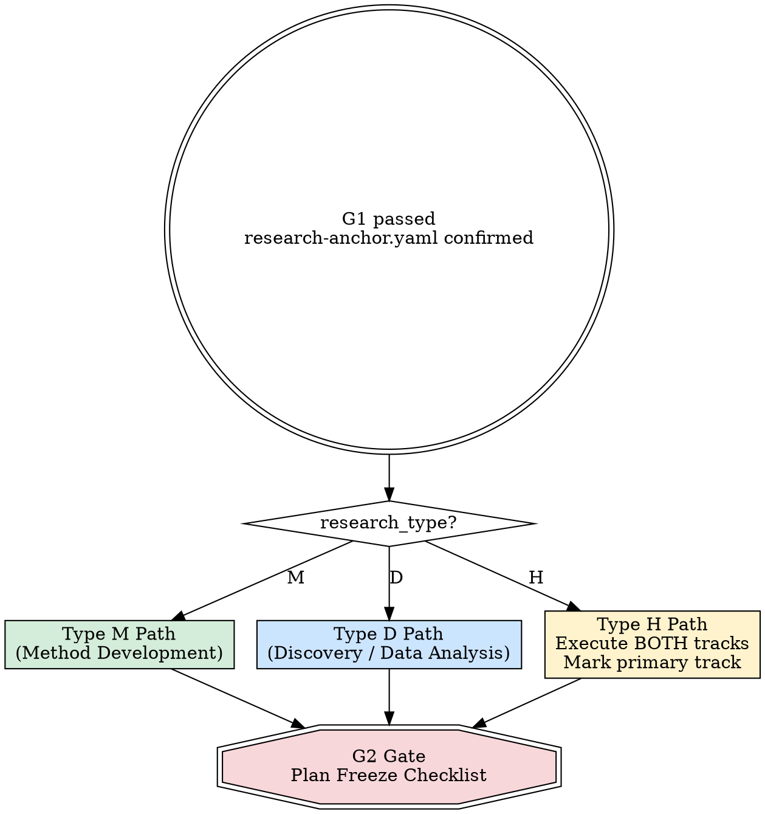

<HARD-GATE>
NO CODE BEFORE PLAN FREEZE (G2). Do NOT write implementation code, run experiments, or build pipelines until the G2 gate checklist at the end of this skill is fully satisfied and user-approved.
</HARD-GATE>

# Method & Framework Design (Phase 3)

## Overview

This is the most critical branching point in the research workflow. Type M and Type D projects follow completely different design paths. Executing the wrong path — or skipping design entirely — guarantees wasted effort.

## Branching Logic

Read `research_type` from `docs/01_intake/research-anchor.yaml`. If absent, STOP and invoke `domain-anchoring` first.

---

## Type M Path — Method Development

### M-Step 1: Lock Evaluation Protocol

**REQUIRED SUB-SKILL:** Invoke `amplify:evaluation-protocol-design` if available. If unavailable, follow the procedure below.

For each item, propose with justification, then get explicit user confirmation before proceeding:

1. **Primary metrics** — why these measure the core claim
2. **Evaluation protocol** — K-fold, train/val/test, episode-based, etc.
3. **Seeds** — recommend: `[42, 123, 456, 789, 1024]`
4. **Statistical reporting** — mean ± std, 95% CI, significance test
5. **Evaluation datasets** — rationale for each dataset choice

Write to `docs/03_plan/evaluation-protocol.yaml` using `templates/evaluation-protocol.yaml`. Set `locked: true` only after user confirms every item.

### M-Step 2: Design Innovation Method

Build on literature insights and cross-domain inspiration from Phase 1–2.

- **Innovation Point** (limit 1–2): state precisely what is novel
- **Value Proposition**: why this works — ground in theory or strong intuition
- **Predicted failure modes**: what could go wrong, and backup plan for each

Write `innovation_point` and `value_proposition` to `research-anchor.yaml`.

### M-Step 3: Confirm Baselines and Pre-Existing Results

**3a. Consolidate baseline list:**

1. Import `user_specified` baselines from Phase 1 (`docs/02_literature/baseline-collection.md`) → these are automatically `must_include`
2. System recommends additional baselines from literature review (target total: 3–5 for `must_include`)
3. Ask user again: *"Are there additional methods you want to compare against?"*
4. For each baseline, record:
   - Name and citation
   - Source: `official_repo` / `our_implementation` / `paper_reported`
   - Official code URL (if available)
   - Configuration notes (hyperparameters, training setup)

**3b. Check for pre-existing results:**

Ask: *"Do you already have results for any of these baselines? (e.g., from your own prior experiments, or from a standardized benchmark leaderboard)"*

If user provides pre-computed results, for each one verify:
- [ ] Which dataset(s) and split(s) were used?
- [ ] Which metrics were reported?
- [ ] How many seeds/runs? What were the seed values?
- [ ] What execution environment? (hardware, software versions)
- [ ] Source: `user_own_run` / `paper_reported` / `leaderboard`

Record in `evaluation-protocol.yaml` baselines section with a `pre_computed` field.

**Compatibility check** — once `evaluation-protocol.yaml` is drafted (M-Step 1), compare pre-computed results against the locked protocol:

| Check | Compatible | Action if incompatible |
|-------|-----------|----------------------|
| Same metric | ✅ | Use directly |
| Different metric | ❌ | Must re-run with correct metric |
| Same dataset + split | ✅ | Use directly |
| Different split | ❌ | Must re-run with correct split |
| ≥ 3 seeds | ✅ | Use directly (even if different seed values) |
| < 3 seeds or unknown | ⚠️ | Accept as reference but re-run for official comparison |
| Same execution regime (e.g., same epochs, same HP budget) | ✅ | Use directly |
| Different regime | ⚠️ | Use as reference; consider re-running for fairness |

Mark each pre-computed result as:
- `accepted` — fully compatible, no re-run needed
- `reference_only` — useful context but must re-run for official comparison
- `incompatible` — must re-run

Write to `evaluation-protocol.yaml` baselines section.

### M-Step 4: Pre-Design Ablation Experiments

For each key component of the proposed method:

| Component | Ablation Method | Expected Impact |
|-----------|----------------|-----------------|
| *(fill)* | Remove / replace / simplify | *(predicted Δ on primary metric)* |

### M-Step 5: Confirm Story Line

Present the complete narrative arc for user approval:

> **Motivation** → **Insight** → **Method** → **Expected Results** → **Analysis Plan**

Do NOT proceed until user explicitly approves.

---

## Type D Path — Discovery / Data Analysis

Type D does NOT need alternative method comparison. Type D is results-driven, not method-driven.

**REQUIRED SUB-SKILL:** Invoke `amplify:analysis-storyboard-design` before finalizing the Type D plan. If unavailable, follow the D-Step process below manually.

### D-Step 1: Design Analysis Framework

Plan analysis dimensions in order:

1. Descriptive statistics & data characterization
2. Main analysis (hypothesis testing / modeling)
3. Mechanism exploration (why does the pattern exist?)
4. Robustness checks (sensitivity, subgroups, alternative specs)
5. Exploratory analysis (unexpected patterns)

Define the story structure:
- **1 main story line** + **2–4 supporting lines**
- For each line: what figures, what statistics, what conclusions

### D-Step 2: Define Sufficiency Criteria

IRON LAW: **ANALYSIS MUST BE COMPREHENSIVE. NO SHORTCUTS.**

Sufficiency checklist — every box must be checked before G2:

- [ ] Data explored from multiple angles?
- [ ] Main hypothesis tested from multiple perspectives?
- [ ] Exploratory analysis planned for unexpected patterns?
- [ ] All analyses connect back to story line?
- [ ] Statistical support sufficient for each claim?
- [ ] Confounders identified and addressed?
- [ ] At least 4–6 content points with planned figures/tables?

### D-Step 3: Pre-Identify Alternative Explanations

For each expected finding, list plausible alternative explanations that analyses must rule out.

| Expected Finding | Alternative Explanation | How to Rule Out |
|-----------------|----------------------|-----------------|
| *(fill)* | *(fill)* | *(specific analysis or control)* |

### D-Step 4: Confirm Story Line

Same format as M-Step 5. Present narrative arc, get explicit user approval.

---

## Type H Path — Hybrid

Execute **both** Type M and Type D tracks. Before starting, ask user: *"Which track is primary — the method contribution or the discovery contribution?"* Mark the answer in `research-anchor.yaml` under `primary_track`.

For Type H, treat both sub-skills as mandatory:
- `amplify:evaluation-protocol-design`
- `amplify:analysis-storyboard-design`

---

## G2 Gate Checklist — Plan Freeze

ALL applicable items must be satisfied. Present this checklist to the user for sign-off.

**Type M items:**
- [ ] `evaluation-protocol.yaml` locked
- [ ] Innovation method fully argued, `innovation_point` marked
- [ ] Baselines confirmed with sources
- [ ] Ablation plan documented
- [ ] Failure modes predicted with backup plans for each

**Type D items:**
- [ ] Analysis framework and storyboard frozen
- [ ] Sufficiency criteria defined and all boxes checked
- [ ] Alternative explanations pre-identified

**Universal items:**
- [ ] Story line confirmed by user
- [ ] `value_proposition` written in `research-anchor.yaml`
- [ ] Venue target still reasonable (invoke `venue-alignment` check)
- [ ] User approved everything explicitly

Only after ALL applicable items pass: set G2 status to `passed` and proceed to execution phase.

---

## Common Rationalizations

| Excuse | Reality |
|--------|---------|
| "Let me just try something first" | Undirected experiments waste compute and produce uninterpretable results. Design first. |
| "The evaluation can be decided later" | Post-hoc evaluation selection is cherry-picking. Lock metrics NOW. |
| "This is too simple to need a full design" | Simple methods still need locked evaluation, baselines, and a story line. Simplicity ≠ no planning. |
| "I already know what will work" | Then it should be trivial to write down. If you can't write it, you don't know it. |
| "Baselines are obvious" | Obvious to you ≠ convincing to reviewers. Document and confirm. |
| "Analysis doesn't need a framework" | Unstructured analysis produces shallow, incomplete results every time. |

## Red Flags — STOP Immediately

- Writing implementation code before G2 passes
- Choosing metrics without user discussion
- Skipping baselines "because the method is different"
- Starting Type D analysis without sufficiency criteria
- Merging Type H tracks without marking a primary
- Proceeding without explicit user approval on story line

## Checklist

1. Read `research_type` from `research-anchor.yaml`
2. Branch to correct path (M / D / H)
3. Complete all steps for the applicable path
4. Present G2 gate checklist to user
5. Get explicit user approval on every item
6. Mark G2 as passed — proceed to `experiment-execution`

<IRON-LAW>
## ⛔ MANDATORY STOP — After G2 Gate

After presenting the G2 gate checklist, **END YOUR RESPONSE IMMEDIATELY.**

Do NOT invoke `experiment-execution` in this same response.
Do NOT begin implementing code, downloading data, or setting up experiments.
Do NOT proceed to G3 check.

**STOP. WAIT. The user must approve the frozen plan before any execution begins.**

Your final output should be the G2 checklist followed by:
"G2 gate checklist is above. Plan is frozen. Do you approve proceeding to Phase 4 (Experiment Execution)?"

Then STOP.
</IRON-LAW>
