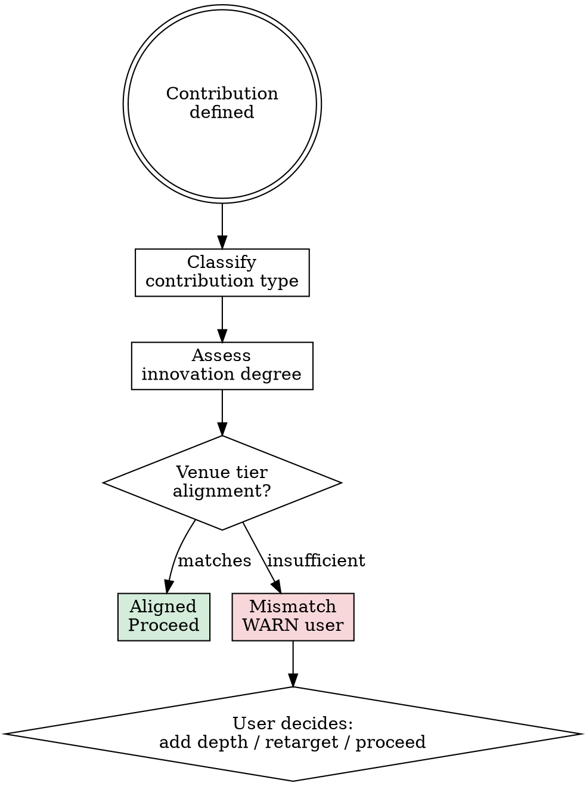

# Novelty Classifier (Meta-Control Layer)

## Overview

Overstating novelty wastes months of work on a paper that will be rejected. This skill forces honest classification of the contribution type and innovation degree, then checks alignment with the target venue.

**Core principle:** Classify honestly, match realistically.

**Violating the letter of this rule is violating the spirit of this rule.**

## The Iron Law

```
CLASSIFY NOVELTY HONESTLY. DO NOT OVERSTATE. VENUE MISMATCH IS CAUGHT HERE, NOT AT REVIEW TIME.
```

## When This Runs

1. **After Phase 1 (literature review):** Preliminary classification — is the proposed direction novel enough for the target venue?
2. **After Phase 3 (method design):** Final classification — does the concrete method meet the novelty bar?

If classification downgrades between Phase 1 and Phase 3, WARN the user immediately.

## Classification Flow



## Step 1 — Contribution Type Classification

| Type | Description | Example |
|------|-------------|---------|
| New Problem | First to formulate this problem | Defining few-shot learning |
| New Method | Novel algorithm or architecture | Transformer architecture |
| New Theory | Theoretical advance | PAC learning bounds |
| New Data/Benchmark | New dataset or evaluation standard | ImageNet |
| Engineering Integration | Combining existing techniques | Adding attention to existing model |

Classify the contribution into exactly one primary type. If it spans two, pick the stronger one and note the secondary.

## Step 2 — Innovation Degree Assessment

| Degree | Definition |
|--------|------------|
| Foundational | Opens a new research direction |
| Significant improvement | Clear advance over SOTA with novel insight |
| Incremental improvement | Modest advance, refines existing approach |
| Combination/Engineering | Assembles known parts in new configuration |

Be precise. "Significant" requires a novel insight, not just better numbers.

## Step 3 — Venue-Innovation Alignment Check

| Venue Tier | Minimum Innovation |
|-----------|-------------------|
| A (NeurIPS/ICML/Nature) | New method with significant insight, or foundational |
| B (AAAI/IJCAI/domain top) | Significant improvement or meaningful combination with strong experiments |
| C (workshops/lower journals) | Incremental improvement with solid experiments |

## Warning Rules

- **Engineering Integration + Tier A target →** WARN: "This may not have sufficient novelty for [venue]. Consider: (a) identify a deeper insight, (b) add theoretical analysis, (c) target Tier B venue."
- **Incremental improvement + Tier A target →** WARN with same options.
- **Scale-up / backbone swap / hyperparameter tuning only →** HARD WARNING: "This is not a research contribution. It is engineering. Redefine the contribution or kill the submission."

Warnings are presented to the user. The agent does not suppress them.

## Red Flags — STOP

- Classifying engineering work as "novel method"
- Claiming foundational novelty without a new problem formulation
- Skipping this check to avoid uncomfortable results
- Upgrading classification between runs without new evidence
- Targeting Tier A with incremental work and no theoretical backing

## Rationalization Prevention

| Excuse | Reality |
|--------|---------|
| "Our combination is novel" | Is the insight novel, or just the combination? Reviewers will ask. |
| "No one has done exactly this" | Exact novelty ≠ meaningful novelty. What new insight does it provide? |
| "The experiments will show it's better" | Better results from engineering ≠ scientific contribution. |
| "We can frame it as novel" | Framing doesn't survive peer review. Real novelty does. |

## The Bottom Line

```
Honest classification now → correct venue targeting → accepted paper
Inflated classification now → months of work → desk rejection
```

Classify honestly. Match realistically. Correct course early.
