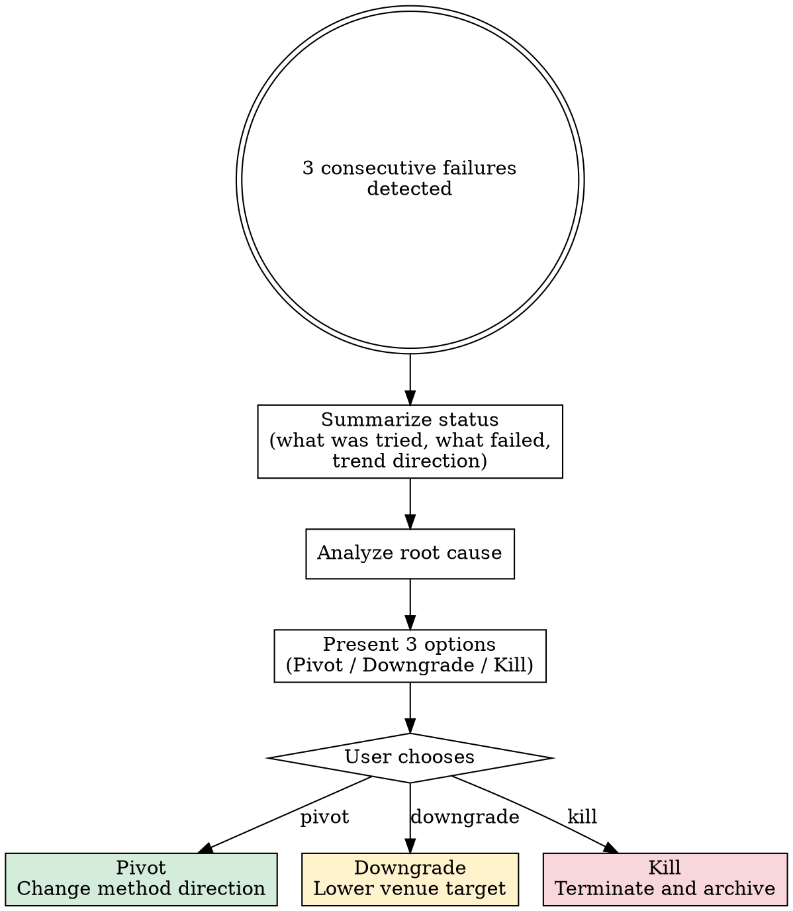

# Pivot or Kill (Meta-Control Layer)

## Overview

Repeated failure is signal, not noise. When 3 consecutive core experiments fail expectations, stop iterating and escalate. The agent does not get to decide whether to continue — the user does.

**Core principle:** Honesty over optimism. Escalate over iterate.

**Violating the letter of this rule is violating the spirit of this rule.**

## The Iron Law

```
AFTER 3 CONSECUTIVE FAILURES, STOP EXPERIMENTING. ESCALATE TO USER.
```

No fourth attempt. No "quick fix." Escalate.

## Trigger and Escalation Flow



## Step 1 — Summarize Status Honestly

State plainly:
- What was tried (each of the 3 attempts)
- What failed (specific metrics, specific gaps)
- Trend direction (improving, flat, or worsening)

Do NOT soften language. "Results declined across all three attempts" is correct. "Results showed some variability" is evasion.

## Step 2 — Analyze Failure Root Cause

Classify the failure into one of these categories:

| Category | Description | Signal |
|----------|-------------|--------|
| Method flaw | Core assumption is wrong | All variants fail similarly |
| Data issue | Insufficient, noisy, or wrong distribution | Results vary wildly or ceiling is low |
| Implementation bug | Code-level error | Should be caught by debugging, not this skill |
| Evaluation too strict | Unrealistic expectations | Baselines also fail to meet the bar |

Be specific. "Something is off" is not a root cause.

## Step 3 — Present Exactly Three Options

Present all three. No filtering, no pre-selecting.

**a) Pivot** — Change method direction.
- Specify: what changes, what stays
- Estimated additional time
- Risk level (high/medium/low)

**b) Downgrade** — Lower venue target.
- Specify: new target venue
- What experiments can be cut
- What story line changes

**c) Kill** — Terminate the project.
- Archive all records and results
- Document lessons learned
- Free resources for other work

## Step 4 — User Decides

```
THE AGENT CANNOT MAKE THIS DECISION. WAIT FOR USER.
```

Present the options. Stop. Do not nudge. Do not recommend. The user decides.

## Red Flags — STOP

- Attempting a 4th fix without user consultation
- Downplaying failure severity ("close to working", "almost there")
- Blaming infrastructure instead of method
- Framing continued iteration as "one last thing"
- Silently lowering success criteria instead of escalating

## Rationalization Prevention

| Excuse | Reality |
|--------|---------|
| "One more try might work" | You said that twice already. Escalate. |
| "I think I see the issue now" | You thought that before too. Escalate. |
| "Killing the project is too drastic" | Killing saves resources for better projects. It's responsible, not drastic. |
| "Let me just tune hyperparameters" | Tuning is not innovation. If 3 approaches failed, the problem is deeper. |
| "The baseline is just very strong" | That's useful information. Maybe this gap isn't solvable with your approach. |

## The Bottom Line

```
3 failures → stop → summarize → escalate → user decides
```

Honesty is not pessimism. Escalation is not failure. Continuing blindly is.
