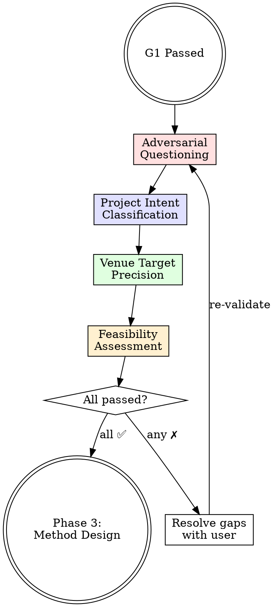

<IRON-LAW>
THIS PHASE IS NEVER OPTIONAL. It is required for ALL research types:
- Type M: adversarial questioning catches flawed assumptions before expensive experiments
- Type D: stress-testing the research question prevents shallow "we looked at data and found stuff" discoveries
- Type C: questioning reveals usability assumptions
- Type H: needed for both method and discovery components

"It's just data analysis, no need for validation" is the #1 reason Type D projects fail. DO NOT SKIP THIS PHASE.
</IRON-LAW>

# Problem Validation (Phase 2)

## Overview

A direction that survived Phase 1 is a candidate, not a commitment. This skill stress-tests the research problem through adversarial questioning before resources are invested. Passing this skill is required to enter method design.

<HARD-GATE>
Do NOT proceed to method design, experiment planning, or any Phase 3 activity until every item in the Feasibility Gate at the end of this skill is ✅ and the user has explicitly approved. No exceptions.
</HARD-GATE>

## Activation Flow



## Step 1 — Multi-Perspective Adversarial Questioning

Simulate a thesis defense committee. Present challenges from each perspective and record the user's response. Any challenge left unanswered is marked as **open risk** in `research-anchor.yaml`.

### Reviewer Perspective

- "What is the essential difference between your approach and XX?"
- "Can you quantify the gap you claim to address?"
- "What is your core assumption, and what breaks if it's wrong?"

### Domain Expert Perspective

- "How important is this problem in practice? Who benefits?"
- "Is available data sufficient in quantity and quality?"
- "Does domain knowledge suggest this approach is viable?"

### Statistician Perspective (Type M required)

- "How will you verify improvement is not random? State the statistical test."
- "Are baselines given a fair comparison? Same budget, same data, same tuning?"
- "What is your minimum detectable effect size given your sample?"

### Senior Professor Perspective

- "Explain your contribution in exactly three sentences."
- "If the method works, what does that tell us? If it doesn't, what does that tell us?"
- "Why should a reviewer accept this over the next-best competing submission?"

<HARD-GATE>
Every challenge must have a clear, documented response. Unanswered challenges → mark as risk. Three or more open risks → do NOT proceed. Discuss with user first.
</HARD-GATE>

## Step 2 — Project Intent Classification

Explicitly classify the project. Ask the user to confirm ONE primary intent:

- □ **Performance** — Beat SOTA on established benchmarks
- □ **Efficiency** — Match performance at lower cost (compute, data, latency)
- □ **Quality** — Improve interpretability, reliability, or robustness
- □ **Discovery** — Answer a scientific question or reveal a phenomenon
- □ **Engineering** — Build a practical, deployable tool or system

Write the confirmed value to `research-anchor.yaml` field `project_intent`. If the user selects multiple, require a primary and mark others as secondary.

## Step 3 — Venue Target Precision

Re-evaluate the target venue chosen in Phase 1 against the validated problem:

1. State the current target venue and its acceptance bar
2. Ask: "Given this adversarial analysis, is [venue] still realistic?"
3. Compare novelty level, expected results strength, and contribution type against recent acceptances at that venue

If novelty or scope is insufficient for the original target → recommend a specific downgrade with justification (e.g., "Workshop paper at X" or "Tier-2 venue Y"). Record the decision in `research-anchor.yaml` field `venue_target`.

## Step 4 — Final Feasibility Assessment

**ALL items must be ✅ to proceed:**

- ✅ Problem is worth researching (validated gap, meaningful impact)
- ✅ Method direction is feasible (not blocked by theoretical or practical barriers)
- ✅ Data is available and sufficient for the planned evaluation
- ✅ Resources are sufficient for the target venue's expected experiment scale
- ✅ Innovation level matches the target venue tier
- ✅ User explicitly approves proceeding

Present this checklist to the user. Any ✗ → resolve before advancing.

## Red Flags — STOP

- Rushing past adversarial questions ("the problem is obviously good")
- Refusing to classify project intent ("it's a bit of everything")
- Targeting a top venue without novel contribution
- Claiming data sufficiency without checking scale requirements
- Skipping the statistician perspective for a Type M project
- Proceeding with open risks undiscussed

## Rationalization Prevention

| Excuse | Reality |
|--------|---------|
| "The problem is obviously important" | Obvious to you ≠ obvious to reviewers. Articulate the importance with evidence. |
| "We already discussed this in Phase 1" | Phase 1 explored. Phase 2 attacks. Different purpose. Answer the challenges. |
| "Adversarial questioning slows us down" | Discovering a fatal flaw in Phase 2 saves months. Answer now. |
| "The venue choice is fine" | Fine is not justified. Compare against the venue's recent acceptance profile. |
| "I can address reviewer concerns later" | If you can't answer now, you can't answer in a rebuttal either. |
| "Multiple intents make the paper stronger" | Unfocused contributions get rejected. Pick one primary intent. |
| "Resources will probably work out" | Probably ≠ verified. Check compute, data, and timeline concretely. |

## The Bottom Line

```
Untested conviction is not research confidence.
Survive the defense before you build the method.
```

**Gate passed → invoke method-framework-design skill for Phase 3.**
**Any item unresolved → resolve with user before proceeding.**

<IRON-LAW>
## ⛔ MANDATORY STOP

After presenting the Final Feasibility Assessment checklist, **END YOUR RESPONSE IMMEDIATELY.**

Do NOT invoke `method-framework-design` or any other skill in this same response.
Do NOT say "let me proceed to Phase 3."
Do NOT begin method or analysis design.

**STOP. WAIT. The user must reply with approval before you do anything else.**

Your final output for this phase should be the feasibility checklist followed by:
"Phase 2 validation complete. Do you approve proceeding to Phase 3 (Method/Analysis Design)?"

Then STOP.
</IRON-LAW>
