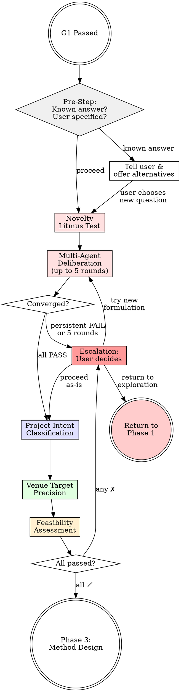

<IRON-LAW>
THIS PHASE IS NEVER OPTIONAL. It is required for ALL research types:
- Type M: adversarial questioning catches flawed assumptions before expensive experiments
- Type D: stress-testing the research question prevents shallow "we looked at data and found stuff" discoveries
- Type C: questioning reveals usability assumptions
- Type H: needed for both method and discovery components

"It's just data analysis, no need for validation" is the #1 reason Type D projects fail. DO NOT SKIP THIS PHASE.
</IRON-LAW>

# Problem Validation (Phase 2)

## Overview

A direction that survived Phase 1 is a candidate, not a commitment. This skill stress-tests the research problem through adversarial questioning before resources are invested. Passing this skill is required to enter method design.

<HARD-GATE>
Do NOT proceed to method design, experiment planning, or any Phase 3 activity until every item in the Feasibility Gate at the end of this skill is ✅ and the user has explicitly approved. No exceptions.
</HARD-GATE>

## Activation Flow



## Re-Entry from Phase 4a (Exploratory Return Path)

If the user returns to Phase 2 from Phase 4a exploration (because the data or baseline results revealed the research question is wrong), do NOT start from scratch:

1. **Read the Phase 4a exploration report** (`docs/05_execution/phase4a-exploration-report.md`)
2. **Carry forward what was learned**:
   - Type M: baseline performance, error analysis findings, actual failure patterns
   - Type D: data characteristics, observed patterns, what the data does/doesn't support
3. **Use exploration insights to reformulate the question**: "Phase 4a exploration showed that [finding]. This means our original question — [original] — needs to be reformulated because [reason]. Based on what we found, a stronger question would be: [suggestion]"
4. **Re-run the multi-agent deliberation** (Step 1) with the new context — agents should have access to the Phase 4a exploration report

This return path ensures that exploration insights directly feed into a better research question, rather than being wasted.

## Pre-Step — Handling User-Specified Research Questions

When the user explicitly states a specific research question (e.g., "帮我研究 GM12878 细胞是什么类型的", "help me determine the cell type composition of dataset X"), do NOT silently override their intent. Instead:

**Case 1 — The question has a known answer:**
If the answer is already well-established in the literature (e.g., GM12878 is a well-characterized lymphoblastoid cell line), tell the user directly:

```
The question "[user's question]" has a well-established answer in 
existing literature:

[State the known answer with citations]

This means a paper answering this exact question would not be publishable 
— it would be confirming what is already known.

However, there may be related questions that ARE worth researching:
1. [Suggest a novel angle using the same system/data]
2. [Suggest a comparative or mechanistic extension]
3. [Suggest applying the system to a genuinely open question]

Alternatively, if you need this analysis for purposes OTHER than 
publishing a research paper (e.g., as part of a larger project, 
for educational purposes, or as preliminary exploration), I can 
help with that — just let me know and we'll adjust the workflow 
accordingly.

What would you prefer?
```

**Case 2 — The question is valid but may be weak:**
Proceed to Step 0 (Novelty Litmus Test) and the multi-agent deliberation. The agents will evaluate and suggest improvements. The user's original intent is respected as the STARTING POINT for discussion.

**Case 3 — The question is strong and specific:**
Proceed normally. The user's expertise should be respected — they may know their field better than the agents.

**KEY PRINCIPLE:** The system serves the user, not the other way around. If the user insists on a question after being informed of its limitations, respect their decision (see escalation mechanism in Step 1).

## Step 0 — Scientific Novelty Litmus Test (BEFORE adversarial questioning)

<IRON-LAW>
Before any detailed questioning, apply this quick filter. If the proposed research fails this test, it MUST be restructured — not "answered better" in the adversarial round.

**The question to ask yourself:**
"If this project succeeds perfectly, what NEW biological/scientific knowledge exists that didn't exist before?"

**FAIL examples (NOT publishable):**
- "We confirm that PBMC data contains T cells, B cells, and monocytes" → This is known. Running a standard pipeline on standard data is not a discovery.
- "We show that scanpy can cluster single-cell data correctly" → This is a tutorial, not research.
- "We provide a reproducible analysis template" → Reproducibility is good practice, not a contribution by itself.
- "We validate that existing methods work on existing data" → Validation without new insight is an exercise.

**PASS examples (potentially publishable):**
- "We discover a previously uncharacterized cell subpopulation in disease X tissue" → New finding.
- "We reveal that gene Y, not previously associated with cell type Z, is a more reliable marker in context W" → New biological insight.
- "We show that the cellular composition of tissue X changes significantly between condition A and B, suggesting mechanism C" → New comparative insight.
- "We integrate N datasets to reveal a conserved differentiation trajectory not visible in individual datasets" → New synthesis.

**For Type D specifically:** The novelty MUST be biological, not methodological. "We used standard tools in a reproducible way" is NOT novel. The question that the analysis answers must be one whose answer is NOT already known.

If the proposed question fails this test, tell the user honestly:
```
The current research question — "[question]" — would likely be viewed
as a technical exercise rather than a scientific contribution by
reviewers at [venue]. The expected findings are already well-established.

To make this publishable, we need a question whose answer is genuinely
unknown. Some options:
1. [Suggest a more specific, novel question using the same data/tools]
2. [Suggest different data that could yield novel findings]
3. [Suggest a comparative angle that could produce new insights]

Which direction interests you?
```

Do NOT proceed to adversarial questioning with a question that fails this test. Restructure first.

**CRITICAL: "We'll find the real question in Phase 3" is NOT acceptable.**

If the user's request is vague (e.g., "analyze this data and find discoveries"), you MUST help them formulate a SPECIFIC, testable question NOW — before leaving Phase 2. Acceptable approaches:

1. **Propose 2-3 concrete candidate questions** based on the literature review from Phase 1
2. **Require the user to choose one** (or propose their own)
3. **Test the chosen question** against the PASS/FAIL examples above

A question is specific enough when it names: (a) the biological system or phenomenon, (b) the comparison or contrast, and (c) what kind of answer would be new. Example: "Do classical and non-classical monocytes show distinct transcriptional programs in untreated vs. treated patients?" — this names the system (monocytes), the comparison (untreated vs. treated), and the novelty (programs not previously compared in this context).

"Are there interesting subpopulations in this dataset?" is NOT specific — it is a fishing expedition.
</IRON-LAW>

## Step 0b — Data Novelty Pre-Screen (Type D REQUIRED)

<IRON-LAW>
For Type D (discovery/data analysis), the choice of data is HALF the research question. If you pick a dataset that has been analyzed hundreds of times with the same tools you plan to use, you WILL NOT find anything new. This must be caught HERE, not after weeks of analysis.

**Over-Analyzed Dataset Warning List** (non-exhaustive — use judgment for unlisted datasets):
- PBMC 3k / 10k (10x Genomics tutorials) — every scRNA-seq tool's demo data
- Iris, MNIST, CIFAR-10 — ML benchmarks, not research data
- Titanic, Boston Housing — educational datasets
- Any dataset that appears as the primary example in a major tool's tutorial

If the user wants to use such a dataset, you MUST warn them:

```
⚠️ DATA NOVELTY WARNING

The dataset "[name]" is one of the most frequently analyzed datasets in 
[field]. Standard analysis pipelines have been applied to it hundreds 
of times, and its major features are well-documented.

Using this dataset with standard tools is very unlikely to produce 
novel findings suitable for a research paper.

Options to proceed:
1. Use a DIFFERENT, less-studied dataset (I can help identify one)
2. Apply a genuinely NOVEL analytical approach to this dataset
3. Use this dataset for a COMPARATIVE study with other datasets
4. Proceed knowing the paper will likely be a technical note / 
   benchmark report, not a discovery paper

Which option do you prefer?
```

Do NOT silently proceed with an over-analyzed dataset. The user must make an informed choice.
</IRON-LAW>

## Step 1 — Multi-Agent Research Question Deliberation (AUTOMATED — MANDATORY)

<IRON-LAW>
The research question is the SINGLE MOST IMPORTANT decision in the entire project. It determines the paper's positioning, caliber, and competitiveness. A single agent cannot adequately stress-test a research question — blind spots are inevitable.

This step dispatches THREE specialist agents to deliberate on the research question through the `amplify:multi-round-deliberation` protocol (max 5 rounds). This is NOT optional.
</IRON-LAW>

### Agent Composition

Three agents with distinct, complementary perspectives (adapted by research type):

**Type M / D / H:**

| Agent | Role | What They Optimize For |
|-------|------|----------------------|
| **Senior Professor** | Domain authority with strategic vision | Is this question scientifically meaningful? Does it advance the field? |
| **Journal/Conference Editor** | Venue gatekeeper | Would I send this to reviewers, or desk-reject? Does it meet [venue]'s bar? |
| **Research Scientist (PhD/Postdoc)** | Hands-on execution expert | Is this feasible? Can I actually answer this question with the available data/tools/time? |

**Type C (Tool/Software) — different agent composition:**

| Agent | Role | What They Optimize For |
|-------|------|----------------------|
| **Target User Representative** | A domain practitioner who would use this tool | Does this solve a REAL pain point? Would I switch from my current tool to this? |
| **Journal/Conference Editor** | Venue gatekeeper (same as above) | Does the tool contribution meet [venue]'s bar? Is it more than engineering? |
| **Software Architect** | Experienced developer of research tools | Is the architecture sound? Can this scale? Is the API well-designed? How does this compare to existing tools technically? |

### Dispatch — Round 1 (parallel)

**Prepare the context package** (shared by all agents):
- Research question (from Step 0)
- Research type (M/D/C/H)
- Literature review summary (from Phase 1)
- Gap analysis (from Phase 1)
- Target venue
- Available data and resources

**Agent 1 — Senior Professor:**

```
Call Task tool with:
  description: "Senior Professor — evaluate research question"
  prompt: |
    SHARED VALUES:
    Target venue: [venue]. Research type: [type].
    Optimization target: "Is this question worth publishing at [venue]?"
    Scoring: PASS / CONDITIONAL / FAIL
    
    You are a tenured full professor at a top-5 university in [FIELD], 
    with 20+ years of active publication. You have served on hundreds 
    of thesis committees and as area chair at [venue] or equivalent. 
    You have an instinct for which questions lead to impactful papers 
    and which lead to dead ends.
    
    RESEARCH QUESTION: "[question]"
    RESEARCH TYPE: [type]
    
    CONTEXT:
    - Literature review: [paste summary]
    - Gap analysis: [paste summary]
    - Available data/resources: [paste summary]
    
    Evaluate this research question from your perspective:
    
    1. SCIENTIFIC SIGNIFICANCE: Does this question address a genuine 
       gap in the field? Would answering it change how people think 
       about [subfield]? Or is it incremental/confirmatory?
    
    2. NOVELTY: What NEW knowledge will exist after this project that 
       didn't exist before? Be specific. "We confirm known results with 
       a new tool" is NOT novel.
    
    3. STRATEGIC POSITIONING: Where does this sit in the field's trajectory? 
       Is the timing right? Will this still matter in 12 months?
    
    4. WORTH-DOING TEST: Is this question worth serious research investment? 
       If not, why not? What related question WOULD be worth pursuing?
    
    5. SUGGESTED IMPROVEMENTS: If the question is weak, propose 2-3 
       alternative formulations that would be stronger. Be specific.
    
    6. VERDICT: PASS / CONDITIONAL / FAIL
       If CONDITIONAL: what SPECIFIC changes would make this a PASS?
       If FAIL: what is fundamentally wrong?
  subagent_type: "generalPurpose"
```

**Agent 2 — Journal/Conference Editor:**

```
Call Task tool with:
  description: "Journal Editor — evaluate research question"
  prompt: |
    SHARED VALUES:
    Target venue: [venue]. Research type: [type].
    Optimization target: "Would I send this to reviewers at [venue]?"
    Scoring: PASS / CONDITIONAL / FAIL
    
    You are an associate editor at [TARGET VENUE]. You handle 200+ 
    submissions per year and desk-reject ~40% before they reach 
    reviewers. You know exactly what [venue]'s reviewers expect 
    and what makes them excited vs. dismissive.
    
    RESEARCH QUESTION: "[question]"
    
    CONTEXT:
    - Literature review: [paste summary]
    - Gap analysis: [paste summary]
    
    Evaluate from your editorial perspective:
    
    1. DESK-REJECT TEST: Based on the research question alone, would 
       you send this to reviewers or desk-reject? Why?
    
    2. VENUE FIT: Does this question match [venue]'s scope, impact 
       expectations, and recent publication trends? Cite specific 
       recent papers at this venue for comparison.
    
    3. REVIEWER PREDICTION: What will Reviewer 2 complain about? 
       What's the most likely "fatal flaw" a reviewer would identify?
    
    4. COMPETITIVE LANDSCAPE: How many similar papers has [venue] 
       published in the last 2 years? Is the community saturated 
       with this topic?
    
    5. SUGGESTED IMPROVEMENTS: How could the question be reframed to 
       better fit [venue]? Would a different venue be more appropriate?
    
    6. VERDICT: PASS / CONDITIONAL / FAIL
  subagent_type: "generalPurpose"
```

**Agent 3 — Research Scientist (PhD/Postdoc):**

```
Call Task tool with:
  description: "Research Scientist — evaluate feasibility"
  prompt: |
    SHARED VALUES:
    Target venue: [venue]. Research type: [type].
    Optimization target: "Can I actually answer this question rigorously?"
    Scoring: PASS / CONDITIONAL / FAIL
    
    You are a senior PhD student or postdoc who has actually conducted 
    research in [FIELD]. You have hands-on experience with the tools, 
    datasets, and methods involved. You know the difference between 
    a question that SOUNDS good in a proposal and one that can 
    actually be ANSWERED with available resources.
    
    RESEARCH QUESTION: "[question]"
    
    CONTEXT:
    - Available data: [paste data description]
    - Available compute/tools: [paste resource summary]
    - Research type: [type]
    
    Evaluate from your execution perspective:
    
    1. FEASIBILITY: Can this question be answered with the available 
       data, tools, and compute? What's missing?
    
    2. METHODOLOGY GAP: Do we have the right methods to answer this? 
       Are there methodological challenges the question glosses over?
    
    3. DATA SUFFICIENCY: Is the data adequate in quantity, quality, 
       and diversity to support the claims this question implies?
    
    4. TIMELINE REALISM: How long would this take to execute properly? 
       Is the scope reasonable?
    
    5. HIDDEN TRAPS: What practical pitfalls do you foresee that the 
       professor and editor might miss? (e.g., data quality issues, 
       confounders, computational bottlenecks, reproducibility concerns)
    
    6. SUGGESTED IMPROVEMENTS: How could the question be scoped better 
       for feasible execution?
    
    7. VERDICT: PASS / CONDITIONAL / FAIL
  subagent_type: "generalPurpose"
```

### Process Results — Multi-Round Deliberation (up to 5 rounds)

**REQUIRED SUB-SKILL:** Follow `amplify:multi-round-deliberation` protocol.

**After Round 1 agents return:**

1. **Synthesize** — identify agreements, disagreements, and the key tensions
2. **Refine the research question** based on all three perspectives:
   - Incorporate the professor's strategic suggestions
   - Address the editor's venue-fit concerns
   - Respect the scientist's feasibility constraints
3. **Re-dispatch ALL three agents** with the refined question + summary of changes

**Convergence criteria:**
- All three agents give PASS on the research question
- The question is specific enough to name: (a) the system/phenomenon, (b) the comparison/contrast, (c) what would be new

**Non-convergence or persistent failure — Escalation to User:**

If after 3+ rounds the question still cannot achieve consensus, or if fundamental problems persist (e.g., "not novel", "desk-reject", "infeasible"), present the user with explicit options:

```
⚠️ RESEARCH QUESTION ESCALATION
═══════════════════════════════════

After [N] rounds of deliberation, the research question has not achieved 
full consensus. Here is the situation:

Current question: "[question]"
Agent verdicts: Professor [X], Editor [X], Scientist [X]

Core problem: [summarize the persistent issue]

YOUR OPTIONS:

1. 🔄 RETURN TO PHASE 1 — Go back to direction exploration. The current 
   direction may not support a strong research question. We can explore 
   alternative directions or sub-directions.

2. 🔧 CONTINUE REFINING — Stay in Phase 2 and try a different angle on 
   the question. I'll propose new formulations based on the agents' 
   suggestions:
   [list 2-3 specific alternative questions]

3. ✅ PROCEED AS-IS — Accept the current question with its known 
   limitations. The paper may target a lower-tier venue or serve 
   as a technical report / preliminary study. 
   [State what the realistic outcome would be]

4. ⏸️ PAUSE — Take time to think. You can come back with a new 
   question or additional context.

Which option do you prefer?
```

This escalation is MANDATORY when:
- Any agent gives persistent FAIL (same issue for 2+ rounds)
- All 5 rounds exhausted without convergence
- The novelty litmus test (Step 0) was borderline and deliberation didn't resolve it

**If user chooses "Return to Phase 1":**
- Reset to Phase 1 (research-direction-exploration)
- Carry forward what was learned (what directions DON'T work and why)
- The user does NOT need to start completely from scratch

**If user chooses "Proceed as-is":**
- Record the user's decision and the known limitations in `research-anchor.yaml`
- Adjust the target venue to match realistic expectations
- Continue to Phase 3 with the user's chosen question
- The system respects the user's autonomy — not everyone needs a top-venue paper

**Special rules:**
- If Senior Professor says "FAIL — not novel enough" and this persists for 2+ rounds → trigger escalation immediately (don't wait for round 5).
- If Editor says "desk-reject" → trigger escalation.
- If Scientist says "infeasible" → trigger escalation.

### Quality of Deliberation Check

<IRON-LAW>
After deliberation converges, verify the final question against these patterns. Vague questions are NOT acceptable even if agents approved them:

| Answer pattern | Verdict |
|---------------|---------|
| "We provide a complete evidence chain" | VAGUE — evidence chain of WHAT? Push for specifics. |
| "Our analysis is reproducible" | NOT A CONTRIBUTION — reproducibility is expected, not novel. |
| "We use standard tools on standard data" | NOT RESEARCH — this is an exercise. |
| "We fill the gap of discovery-oriented analysis" | VAGUE — what specific discovery? |
| "Our contribution is a template for others" | NOT NOVEL — a template is not a scientific finding. |
| "We show results consistent with known biology" | CONFIRMING KNOWN FACTS is not a discovery. |

If the final question still matches these patterns after deliberation, it needs fundamental rethinking. Tell the user.
</IRON-LAW>

### Present Deliberation Results to User

```
Phase 2 — Research Question Deliberation Results:
══════════════════════════════════════════════════

Rounds completed: [N] / max 5

FINAL RESEARCH QUESTION:
"[refined question]"

Agent verdicts:
  Senior Professor:      [PASS/COND/FAIL] — [1-line summary]
  Journal Editor:        [PASS/COND/FAIL] — [1-line summary]
  Research Scientist:    [PASS/COND/FAIL] — [1-line summary]

Key improvements from deliberation:
  Round 1 → 2: [what changed and why]
  Round 2 → 3: [what changed and why]
  ...

Remaining concerns (if any):
  ⚠️ [concern] — [which agent, what they recommend]

Original question: "[original]"
Final question:    "[refined]"
```

<HARD-GATE>
All three agents must reach PASS (or the user must explicitly accept CONDITIONAL items) before proceeding. Three or more unresolved FAIL items → do NOT proceed. Discuss with user.
</HARD-GATE>

## Step 2 — Project Intent Classification

Explicitly classify the project. Ask the user to confirm ONE primary intent:

- □ **Performance** — Beat SOTA on established benchmarks
- □ **Efficiency** — Match performance at lower cost (compute, data, latency)
- □ **Quality** — Improve interpretability, reliability, or robustness
- □ **Discovery** — Answer a scientific question or reveal a phenomenon
- □ **Engineering** — Build a practical, deployable tool or system

Write the confirmed value to `research-anchor.yaml` field `project_intent`. If the user selects multiple, require a primary and mark others as secondary.

## Step 3 — Venue Target Precision

Re-evaluate the target venue chosen in Phase 1 against the validated problem:

1. State the current target venue and its acceptance bar
2. Ask: "Given this adversarial analysis, is [venue] still realistic?"
3. Compare novelty level, expected results strength, and contribution type against recent acceptances at that venue

If novelty or scope is insufficient for the original target → recommend a specific downgrade with justification (e.g., "Workshop paper at X" or "Tier-2 venue Y"). Record the decision in `research-anchor.yaml` field `venue_target`.

## Step 4 — Final Feasibility Assessment

**ALL items must be ✅ to proceed:**

- ✅ Problem is worth researching (validated gap, meaningful impact)
- ✅ Method direction is feasible (not blocked by theoretical or practical barriers)
- ✅ Data is available and sufficient for the planned evaluation
- ✅ Resources are sufficient for the target venue's expected experiment scale
- ✅ Innovation level matches the target venue tier
- ✅ User explicitly approves proceeding

Present this checklist to the user. Any ✗ → resolve before advancing.

## Red Flags — STOP

- Rushing past adversarial questions ("the problem is obviously good")
- Refusing to classify project intent ("it's a bit of everything")
- Targeting a top venue without novel contribution
- Claiming data sufficiency without checking scale requirements
- Skipping the statistician perspective for a Type M project
- Proceeding with open risks undiscussed

## Rationalization Prevention

| Excuse | Reality |
|--------|---------|
| "The problem is obviously important" | Obvious to you ≠ obvious to reviewers. Articulate the importance with evidence. |
| "We already discussed this in Phase 1" | Phase 1 explored. Phase 2 attacks. Different purpose. Answer the challenges. |
| "Adversarial questioning slows us down" | Discovering a fatal flaw in Phase 2 saves months. Answer now. |
| "The venue choice is fine" | Fine is not justified. Compare against the venue's recent acceptance profile. |
| "I can address reviewer concerns later" | If you can't answer now, you can't answer in a rebuttal either. |
| "Multiple intents make the paper stronger" | Unfocused contributions get rejected. Pick one primary intent. |
| "Resources will probably work out" | Probably ≠ verified. Check compute, data, and timeline concretely. |

## The Bottom Line

```
Untested conviction is not research confidence.
Survive the defense before you build the method.
```

**Gate passed → invoke method-framework-design skill for Phase 3.**
**Any item unresolved → resolve with user before proceeding.**

<IRON-LAW>
## ⛔ MANDATORY STOP

After presenting the Final Feasibility Assessment checklist, **END YOUR RESPONSE IMMEDIATELY.**

Do NOT invoke `method-framework-design` or any other skill in this same response.
Do NOT say "let me proceed to Phase 3."
Do NOT begin method or analysis design.

**STOP. WAIT. The user must reply with approval before you do anything else.**

Your final output for this phase should be the feasibility checklist followed by:
"Phase 2 validation complete. Do you approve proceeding to Phase 3 (Method/Analysis Design)?"

Then STOP.
</IRON-LAW>
