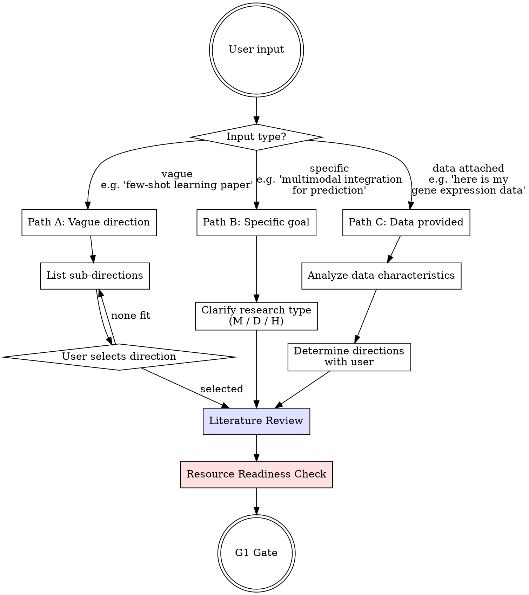

# Research Direction Exploration (Phase 1)

## Overview

Identify research direction, review literature, find gaps, confirm resources. Three entry paths based on user input specificity.

<HARD-GATE>
Do NOT proceed to method design, experiment planning, or any Phase 2 activity until the G1 Gate Checklist at the end of this skill is fully satisfied and the user has approved. No exceptions.
</HARD-GATE>

## Dynamic Expert Persona for Direction Exploration

<IRON-LAW>
Before exploring any research direction, you MUST adopt a domain-appropriate expert persona. Generic exploration produces generic ideas. You are not a general-purpose assistant browsing papers — you are a senior researcher who has published extensively in this field, evaluating where the next breakthrough lies.

**Persona generation (execute immediately after domain is identified):**

Based on the domain from `research-anchor.yaml` (or the user's initial description), generate and adopt this persona:

```
You are a tenured professor at a top research university (e.g., MIT, Stanford, 
Harvard, or equivalent in the relevant country/field), with 15+ years of 
active publication in [SPECIFIC FIELD]. You have:
- Published 100+ papers in [FIELD], including seminal works
- Served as area chair / associate editor at [TARGET VENUE or top venues in field]
- Mentored 20+ PhD students through successful dissertations
- Deep knowledge of which problems are genuinely open vs. already solved
- A reputation for identifying high-impact research directions early

Your evaluation criteria for a promising research direction:
1. Is this a REAL gap, or a gap that exists only in the framing?
2. Is this direction worth serious research investment?
3. Is the timing right — are the tools/data/theory mature enough?
4. Will this still be relevant when the paper is published (6-12 months)?
5. Can a strong result here change how people think about [subfield]?
```

Use this persona throughout Phase 1 — when evaluating sub-directions, assessing gaps, judging competition level, and making recommendations. The persona should influence your JUDGMENT, not just your tone.
</IRON-LAW>

## Re-Entry from Phase 2 (Return Path)

If the user returns to Phase 1 from Phase 2 (because the research question could not be validated), do NOT start from scratch:

1. **Carry forward what was learned**: Record which directions and questions were tried and WHY they failed (e.g., "not novel enough", "infeasible", "desk-reject at target venue")
2. **Exclude exhausted directions**: Don't suggest the same sub-directions that already failed validation
3. **Use failure reasons as search constraints**: If the question failed because "the gap is already filled", search for gaps in adjacent sub-fields. If it failed because "data insufficient", search for directions with better data availability.
4. **Present to user**: "We tried [direction/question] but it didn't pass validation because [reason]. Here are alternative directions that avoid this problem: [list]"

This return path ensures Phase 1 and Phase 2 work as a tightly coupled loop when needed, without wasting the work already done.

## Entry Path Selection



## Path A — Vague Direction

User gives a broad topic (e.g., "I want to publish a few-shot learning paper").

1. Search arXiv + Google Scholar for recent activity (last 2 years, top venues)
2. Present 3–5 active sub-directions in this format:

| Sub-direction | Research Heat | Open Problems | Entry Points | Competition |
|---------------|--------------|---------------|--------------|-------------|
| ... | high/med/low | brief list | key papers | high/med/low |

3. Mark recommended option with reasoning
4. User selects → proceed to Literature Review

## Path B — Specific Goal

User states a concrete research goal.

1. Clarify research type with user:
   - **Type M** — New method (model, algorithm, framework)
   - **Type D** — Analyze data (discovery, characterization, mechanism)
   - **Type H** — Hybrid (method + discovery)
2. Proceed directly to Literature Review

## Path C — Data Provided

User supplies a dataset.

1. Analyze data characteristics: dimensions, type (tabular/image/text/graph/multi-modal), scale, quality, label availability
2. Present possible research directions based on data properties
3. Confirm direction and research type with user → proceed to Literature Review

## Literature Review

Execute for ALL paths.

<IMPORTANT>
NEVER fabricate paper contents or citations. If you cannot access or verify the full text of a paper, mark it honestly. Filling a literature table with details you "remember" but cannot verify is academic misconduct.
</IMPORTANT>

### Step 1 — Broad Search

Use web search to find recent papers (last 2 years, top venues):
- Sources: arXiv, Google Scholar, Semantic Scholar, conference proceedings pages
- Collect: titles, authors, venues, abstracts, citation counts, PDF URLs
- Build keyword clusters from initial results
- Target: 15–30 candidate papers for the long list

Save the candidate list with PDF URLs to `docs/02_literature/paper-list.md`.

### Step 2 — Autonomous Full-Text Retrieval

**Try to obtain full text for each candidate paper, in this order:**

1. **Direct PDF download** — Try downloading the PDF to `docs/02_literature/papers/`. Use shell commands (`curl`, `wget`) or any available download tools/APIs. Many sources provide direct PDF links:
   - arXiv: `https://arxiv.org/pdf/XXXX.XXXXX`
   - Semantic Scholar: Open Access PDF links
   - OpenReview: publicly accessible conference papers
   - Publisher open access papers

2. **HTML full text** — If PDF fails, try fetching the HTML version (e.g., arXiv HTML at `https://arxiv.org/html/XXXX.XXXXX`)

3. **API access** — If MCP servers or platform-specific APIs are available (e.g., Semantic Scholar API, institutional proxy), use them

4. **Read downloaded PDFs** — For each successfully downloaded PDF, read it using available file reading tools

After attempting all papers, classify each into one of:

| Status | Meaning |
|--------|---------|
| `full_text` | Full paper successfully obtained and read |
| `abstract_only` | Only title + abstract available; full text inaccessible |
| `download_failed` | PDF URL found but download failed (paywall, 403, etc.) |

### Step 3 — User Assistance (only for what failed)

If any papers remain at `abstract_only` or `download_failed`, present a summary to the user:

```
Literature retrieval report:
  Full text obtained: K papers ✅
  Abstract only / download failed: M papers ⚠️

Papers I could not access:
  1. [Author et al., Year] "Title" — [venue] — URL: [link]
  2. [Author et al., Year] "Title" — [venue] — URL: [link]
  ...

To help me read these, you can:
  A) Download PDFs and place them in: docs/02_literature/papers/
  B) Provide a brief summary of key findings for papers you've read
  C) Tell me which ones to skip (not critical for our direction)

After placing files, just say "papers ready" and I will continue.
```

**When user says "papers ready" (or equivalent):**
1. Scan `docs/02_literature/papers/` for new PDF files
2. Read each new PDF
3. Update the literature table with full-text details
4. Resume the review from where it paused

**If user provides summaries instead of PDFs:**
- Record them with access level `user_summary`
- Use for gap analysis but note lower confidence

**If user says to skip certain papers:**
- Mark as `skipped` and proceed without them
- Note in gap analysis that some sources were not reviewed

### Step 4 — Deep Reading

For the 5–10 most relevant papers (prioritize `full_text`), extract:

| Paper | Access | Problem | Method | Datasets | Metrics | Key Results | Limitations |
|-------|--------|---------|--------|----------|---------|-------------|-------------|

### Step 5 — Gap Analysis

For each identified gap:
- Is it already solved? (check very recent work)
- Why hasn't it been solved?
- How could we approach it?
- Confidence: `high` (based on full text) / `medium` (based on abstracts) / `low` (needs user verification)

### Step 5b — Deep Thinking Strategies

<IRON-LAW>
Gap analysis alone produces "what papers say is missing." This step applies structured thinking strategies to produce "what a creative researcher would think of." Apply ALL 6 strategies to the literature you've read. Not every strategy will yield useful insights — surface only the genuinely interesting ones.
</IRON-LAW>

**Strategy 1 — Contradiction Mining:**
Find papers that disagree with each other:
- "Paper A says X is effective, but Paper B says it isn't — why?"
- Is it different data? Different evaluation? Different assumptions?
- Could resolving this contradiction itself be a research contribution?
- Search for papers that explicitly address this disagreement. If none exist, it's a strong candidate.

**Strategy 2 — Assumption Challenging:**
List 3-5 assumptions that ALL top papers in this area share:
- For each: Is there evidence supporting this assumption, or is it just convention?
- What would happen if this assumption were wrong?
- What experiment would test or challenge it?
- If overturning an assumption would change how the field thinks, it's a strong candidate.

**Strategy 3 — Cross-Domain Transfer:**
Abstract the core problem to its general form (e.g., "fine-grained image recognition" → "distinguishing highly similar categories"):
- Which OTHER fields face the same abstract problem?
- What methods do those fields use that have never been tried here?
- Search for papers at the intersection. If the intersection is empty, it's a strong candidate.

**Strategy 4 — Limitation-to-Opportunity Conversion:**
For the top-5 papers' Limitations and Future Work sections:
- Do new tools, datasets, or theories now exist that DIDN'T exist when the paper was published?
- Has compute become cheap enough to try something previously infeasible?
- Has a prerequisite problem been solved since publication?
- These are explicit invitations from the authors — if the obstacle is now removable, it's a strong candidate.

**Strategy 5 — Counterfactual Reasoning:**
- "What if we replaced core component X with Y?"
- "What if we evaluated with a completely different metric?"
- "What if we applied this method to a different domain's data?"
- "What if we used this data with a paradigm from a different era (e.g., symbolic AI on deep learning problems)?"

**Strategy 6 — Trend Extrapolation:**
- What is the trajectory of this field over the past 3 years? (A → B → C)
- What is the natural next step D?
- Has anyone taken step D? If not, why?
  - Technical obstacle → is it now solvable?
  - Data obstacle → is the data now available?
  - Nobody thought of it → opportunity
  - Tried and failed → find the failure, understand why

Each strategy can trigger **on-demand literature search** to verify insights. Any new papers found go to `paper-list.md` with tag `[Found during Step 5b]`.

**Output:** A list of raw insights (aim for 10-20), each as a structured entry. Save to `docs/02_literature/deep-thinking-insights.md`.

```
# Deep Thinking Insights

## Insight [N]
Strategy:    [which of the 6 strategies]
Observation: [what you noticed — specific, with paper references]
Implication: [what this suggests for a potential research direction]
Evidence:    [papers/data supporting this insight]
Strength:    [strong / moderate / speculative]
             strong = backed by concrete evidence from multiple papers
             moderate = supported by 1-2 papers or clear logical reasoning
             speculative = interesting but needs verification
Verified:    [yes — searched and confirmed gap exists / no — needs literature check]
```

Discard insights rated "speculative" with no path to verification. The remaining insights feed into Step 5c.

### Step 5c — Multi-Idea Generation

Synthesize the raw insights from Step 5b (and the gaps from Step 5) into **5 candidate research ideas**.

**How to synthesize insights into ideas:**

1. **Group related insights** — Cluster the insights from Step 5b by theme. Insights from different strategies that point to the same problem area are strong signals.
2. **For each cluster, ask:** "What single research project would address this?" — formulate a concrete research question, not a vague direction.
3. **Cross-pollinate:** Take an insight from one cluster and ask if it could solve a problem in another cluster. Cross-cluster combinations often produce the most novel ideas.
4. **Ensure diversity:** The 5 ideas should cover different angles. If 3 ideas are minor variants of each other, merge them into 1 and generate 2 truly different alternatives.
5. **Reality-check against gaps:** Every idea should address at least one gap from Step 5. If an idea doesn't fill a real gap, it's a solution without a problem.

Each idea must be a structured card:

```
═══════════════════════════════════════
Idea [N]: [one-line title]
═══════════════════════════════════════
Core question:   [specific, testable research question]
Novelty source:  [which thinking strategy produced this — e.g., "Contradiction 
                  between Paper A and Paper B" or "Cross-domain transfer from NLP"]
Why it matters:  [what changes if this succeeds]
Feasibility:     [high/medium/low] — [reasoning]
Risk:            [what could go wrong, what would make this fail]
Competition:     [who else might be working on this, how crowded]
Estimated scope: [workshop paper / conference / journal]
```

**Rules for idea generation:**
- At least 1 idea must come from Contradiction Mining or Assumption Challenging (these tend to produce the most novel work)
- At least 1 idea must be "safe" (high feasibility, clear path to publication)
- At least 1 idea must be "ambitious" (high impact if it works, but riskier)
- Ideas can combine insights from multiple strategies
- Do NOT just restate the gaps from Step 5 as ideas — the ideas should reflect the DEEPER thinking from Step 5b

### Step 5d — Multi-Agent Idea Brainstorming (AUTOMATED — MANDATORY)

<IRON-LAW>
The 5 candidate ideas are refined through automated multi-agent brainstorming. The user does NOT participate in this step — agents brainstorm autonomously, then the refined result is presented to the user for selection.

This step uses `amplify:multi-round-deliberation` protocol (max 5 rounds).
</IRON-LAW>

**Agent composition:**

| Agent | Role | What They Optimize For |
|-------|------|----------------------|
| **Visionary Researcher** | Creative idea generator and combiner | Pushes ideas further, proposes combinations ("What if we merge Idea 2 and 4?"), generates new variants. Optimizes for novelty and impact. |
| **Pragmatic Advisor** | Feasibility and strategy expert | Challenges each idea on resources, timeline, technical difficulty. Proposes safer variants. Kills ideas that sound good but can't be executed. Optimizes for feasibility and publishability. |
| **Field Scout** | Competition and positioning expert | Checks each idea against field landscape. Flags if a competing group is already doing it. Assesses venue fit and timing. Optimizes for positioning and timing. |

**Dispatch all three agents using the templates below.**

Each agent receives: the 5 idea cards from Step 5c, the literature review summary, the deep thinking insights from Step 5b, and `research-anchor.yaml` (field, venue, resources).

**Agent prompt templates (Round 1):**

```
Call Task tool with:
  description: "Visionary Researcher — idea brainstorming round 1"
  prompt: |
    SHARED VALUES:
    Target venue: [from research-anchor.yaml]
    Research type: [from research-anchor.yaml]
    Field: [from research-anchor.yaml]

    You are the VISIONARY RESEARCHER in a brainstorming panel. Your role is to 
    push ideas further — find hidden potential, propose bold combinations, and 
    imagine what would happen if we were braver. You optimize for NOVELTY and IMPACT.

    LITERATURE CONTEXT:
    [paste literature review summary]

    DEEP THINKING INSIGHTS:
    [paste from deep-thinking-insights.md]

    CANDIDATE IDEAS:
    [paste all 5 idea cards]

    For EACH idea, provide:
    1. Verdict: STRONG / VIABLE / WEAK / KILL
    2. Specific reasoning (2-3 sentences)
    3. How to make this idea MORE novel or impactful (even for STRONG ideas)

    After evaluating all ideas, propose up to 2 NEW ideas or COMBINATIONS:
    - "What if we merged Idea X and Y?" 
    - "What if we took the core of Idea Z but applied it to [different problem]?"
    Format new ideas as complete idea cards.

    Final output: verdicts table + improvement suggestions + any new ideas.
  subagent_type: "generalPurpose"
```

```
Call Task tool with:
  description: "Pragmatic Advisor — idea brainstorming round 1"
  prompt: |
    SHARED VALUES:
    Target venue: [from research-anchor.yaml]
    Research type: [from research-anchor.yaml]
    Resources: [from research-anchor.yaml — compute, data, timeline]

    You are the PRAGMATIC ADVISOR in a brainstorming panel. Your role is to 
    stress-test feasibility — can this actually be done with our resources and 
    timeline? You optimize for FEASIBILITY and PUBLISHABILITY. You are not 
    negative for the sake of it, but you kill ideas that sound exciting but 
    cannot be executed.

    CANDIDATE IDEAS:
    [paste all 5 idea cards]

    For EACH idea, provide:
    1. Verdict: STRONG / VIABLE / WEAK / KILL
    2. Feasibility assessment: what resources are needed? Do we have them?
    3. Timeline risk: can this be done in [timeline from anchor]?
    4. Technical risk: what's the hardest part? What could go wrong?
    5. Publication path: is this a clear paper, or would it be "interesting 
       but hard to write up"?

    For WEAK/KILL ideas: can they be SAVED by reducing scope or changing approach?
    Propose a "safer variant" if one exists.

    Final output: verdicts table + feasibility notes + safer variants.
  subagent_type: "generalPurpose"
```

```
Call Task tool with:
  description: "Field Scout — idea brainstorming round 1"
  prompt: |
    SHARED VALUES:
    Target venue: [from research-anchor.yaml]
    Field: [from research-anchor.yaml]

    You are the FIELD SCOUT in a brainstorming panel. Your role is to assess 
    each idea's positioning in the research landscape — who else is working on 
    this, how crowded is it, is the timing right? You optimize for POSITIONING 
    and TIMING. Use the literature context to ground your assessment.

    LITERATURE CONTEXT:
    [paste literature review summary]

    CANDIDATE IDEAS:
    [paste all 5 idea cards]

    For EACH idea, provide:
    1. Verdict: STRONG / VIABLE / WEAK / KILL
    2. Competition level: who (specific groups/labs if known) might be doing this?
    3. Timing: is the field ready for this? Too early? Too late?
    4. Venue fit: would [target venue] find this interesting?
    5. Differentiation: if competitors exist, what would make OUR version unique?

    Flag any idea where you suspect a competing paper may appear before ours 
    (high urgency / timing risk).

    If you need to verify competition claims, state what you would search for.
    [The main agent will run those searches between rounds.]

    Final output: verdicts table + competition analysis + timing assessment.
  subagent_type: "generalPurpose"
```

**Round 2+ prompt:** Use the re-assessment template from `multi-round-deliberation` protocol, replacing the artifact with the updated idea set and including the previous round's feedback from all agents.

Each agent gives a verdict per idea: **STRONG / VIABLE / WEAK / KILL**, with specific reasoning. (See `multi-round-deliberation` Phase 1 section for rubric definitions and mapping to the core protocol.)

**Deliberation process:**
- Round 1: Independent evaluation of all 5 ideas. Visionary may propose new combinations. Pragmatic may flag fatal feasibility issues. Scout may flag competition.
- Round 2+: Main agent synthesizes feedback — merges, splits, refines, or eliminates ideas — then dispatches ALL 3 agents to re-evaluate the modified set.
- Ideas can die, merge, or be born during brainstorming. The input is 5 ideas but the output may be different ideas that emerged from combinations.

**Convergence:** When agents agree on a ranking of the top 2-3 ideas (all rated STRONG or VIABLE).

**Idea Rescue (when all ideas fail):**
If ALL ideas are rated WEAK or KILL by majority of agents:
1. Agents state WHY all ideas failed — is there a common root cause (e.g., field is saturated, scope too narrow)?
2. Trigger a broadened literature search targeting the identified gap
3. Generate 3 new idea cards from rescue search results
4. Resume deliberation with new ideas (round counter does NOT reset)
5. If STILL no STRONG/VIABLE after max rounds → present situation to user (see "Non-Convergence" below)

**Non-convergence handling:**
If max rounds reached without 2-3 STRONG/VIABLE ideas:
```
Brainstorming did not converge after [N] rounds.

Best ideas so far (with issues):
  [list remaining ideas with agent verdicts and unresolved concerns]

Root cause: [why convergence failed — e.g., "all directions in this subfield 
are heavily competed" or "feasibility constraints eliminate most options"]

Options:
  1. Select one of the above ideas despite concerns (I'll note risks)
  2. Broaden the scope — explore adjacent subfields or different research types
  3. Return to Step 5 (gap analysis) with new literature search constraints
  4. Provide your own research direction (I'll evaluate with same criteria)
```

**Output:** A ranked shortlist of 2-3 refined ideas with full deliberation rationale. Save to `docs/02_literature/brainstorming-results.md`.

**Present to user:**

```
Based on literature analysis, deep thinking strategies, and multi-agent 
brainstorming (N rounds), here are the top research directions:

[Refined idea cards, ranked, with deliberation history]

Deliberation summary:
  - Ideas merged: [which ideas were combined and why]
  - Ideas eliminated: [which ideas were killed and why]
  - Key debates: [major disagreements between agents and how resolved]

Recommendation: Idea [X] because [reasoning]

Which direction would you like to pursue? You can also:
  A) Select one idea as-is
  B) Modify an idea (specify changes — I'll re-evaluate feasibility)
  C) Combine elements from multiple ideas (I'll create a merged card and evaluate)
  D) Propose your own idea (I'll run it through the same 3-agent evaluation)
  E) Reject all and re-run brainstorming with different constraints
```

Then **⛔ STOP** and wait for user response before proceeding.

**Handling user response:**

| User action | What happens next |
|-------------|------------------|
| Selects an idea (A) | Record selection → proceed to Step 6 (Element Collection) |
| Modifies an idea (B) | Apply modifications → dispatch 3 agents for 1-round quick evaluation → present updated card → user confirms → Step 6 |
| Combines ideas (C) | Create merged card → dispatch 3 agents for 1-round quick evaluation → present → user confirms → Step 6 |
| Proposes own idea (D) | Format as idea card → dispatch 3 agents for full evaluation (max 3 rounds) → present with verdicts → user decides |
| Rejects all (E) | Ask user for new constraints or scope change → return to Step 5b with new constraints → re-run Steps 5b→5c→5d |

### Step 6 — Element Collection by Research Type

| Type M / H | Type D |
|------------|--------|
| Alternative methods | Analysis methods |
| Standard benchmarks | Related findings |
| Evaluation metrics | Domain standards |
| Current SOTA values | Accepted thresholds |

### Step 7 — Outputs

Save to project directory:
- `docs/02_literature/paper-list.md` (full candidate list with URLs and access status)
- `docs/02_literature/literature-review.md` (deep reading table, access level per paper)
- `docs/02_literature/gap-analysis.md` (with confidence levels)
- `docs/02_literature/deep-thinking-insights.md` (raw insights from 6 thinking strategies)
- `docs/02_literature/brainstorming-results.md` (5 idea cards + multi-agent deliberation results + final ranking)
- `docs/02_literature/baseline-collection.md` (Type M / H only)
- `docs/02_literature/papers/` (downloaded/user-provided PDFs)

## Baseline & Alternative Method Early Specification (Type M / H only)

After literature review, **proactively ask the user** about baselines. Many users already know what they want to compare against.

```
I've identified several potential baselines from the literature.
Before we move on, let me check:

1. Do you already have specific methods you want to compare against?
   (e.g., "I want to compare with GraphSAGE, GAT, and GIN")

2. Do you already have results for any methods?
   (e.g., "I already ran Method X on Dataset Y, accuracy was 0.87 ± 0.02")

3. Are there methods you know you must NOT miss?
   (e.g., "reviewers at [venue] will definitely ask about Method Z")
```

**If user provides specific methods:**
- Record them immediately in `docs/02_literature/baseline-collection.md`
- Mark as `user_specified` (highest priority — these MUST appear in final comparison)
- In Phase 3, these become `must_include` baselines automatically

**If user provides pre-existing results:**
- Record in `docs/02_literature/baseline-collection.md` with a `[PRE-COMPUTED]` tag
- Capture: method name, dataset, metric values (mean ± std), seeds used, execution details, source (user's own run / paper-reported / third-party benchmark)
- These will be validated against the evaluation protocol in Phase 3 and may or may not need re-running in Phase 4

**If user says "you decide":**
- System recommends 3–5 from the literature review
- Proceed as normal to Phase 3 for confirmation

## Data & Resource Readiness Check

Before leaving Phase 1, verify every item:

| Item | Status | Action if NOT ready |
|------|--------|-------------------|
| Data availability | user-provided / public / needs collection | If public: provide download script. If needs collection: discuss feasibility. |
| Compute resources | sufficient / insufficient | Discuss alternatives or scope reduction. |
| Tool chain | ready / gaps | Identify missing tools, install or find substitutes. |
| Baselines identified (Type M/H) | user-specified / system-recommended / pending | If none: revisit literature. If user has pre-computed results: record them. |

<HARD-GATE>
Any item NOT ready → discuss with user. Do NOT force through to Phase 2.
</HARD-GATE>

## Red Flags — STOP

- Skipping literature review ("I already know the field")
- Assuming research direction without evidence
- Proceeding without data readiness check
- Jumping to method design before G1 approval
- Selecting a direction without checking competition level
- Ignoring negative signals from gap analysis

## Rationalization Prevention

| Excuse | Reality |
|--------|---------|
| "I know this area well" | Literature evolves monthly. Search anyway. |
| "The user said just start coding" | User intent ≠ skip research workflow. Lit review first. |
| "Gap is obvious" | Obvious gaps are often already solved. Verify. |
| "We can review literature later" | Uninformed method design wastes weeks. Review now. |
| "Data looks fine at a glance" | Glance ≠ analysis. Check dimensions, quality, labels. |
| "Resources aren't my concern" | Infeasible plans waste everyone's time. Check now. |

## Preliminary Novelty Assessment

Before entering G1, invoke `amplify:novelty-classifier` for a preliminary assessment:
- Is the proposed direction a new problem, new method, new theory, new data, or engineering integration?
- If classified as engineering integration or scale-up → warn user before G1

This early check prevents investing months in a direction that lacks sufficient novelty for the target venue.

## G1 Gate Checklist

**ALL items must be satisfied. Present to user for explicit approval.**

- [ ] Domain and sub-domain identified and confirmed by user
- [ ] Research type confirmed (M / D / C / H)
- [ ] Expert persona anchored (reviewer focus areas set in `research-anchor.yaml`)
- [ ] Literature review complete (broad + deep reading)
- [ ] Research gap identified and validated (not already solved)
- [ ] Deep thinking strategies applied (Step 5b — insights documented)
- [ ] At least 5 candidate ideas generated (Step 5c — idea cards documented)
- [ ] Multi-agent brainstorming completed (Step 5d — top 2-3 ideas refined)
- [ ] User has selected a research direction from brainstorming results
- [ ] Preliminary novelty assessment completed (novelty-classifier invoked)
- [ ] Target venue estimated (with rationale)
- [ ] Project intent clear (what contribution, for whom)
- [ ] Data and resources assessed as ready
- [ ] `research-anchor.yaml` generated and saved in `docs/01_intake/`
- [ ] User has approved direction to proceed

**Gate passed → invoke problem-validation skill for Phase 2.**
**Any item unchecked → resolve before proceeding.**

<IRON-LAW>
## ⛔ MANDATORY STOP

After presenting the G1 gate checklist to the user, **END YOUR RESPONSE IMMEDIATELY.**

Do NOT invoke `problem-validation` or any other skill in this same response.
Do NOT say "let me proceed to Phase 2."
Do NOT continue generating.

**STOP. WAIT. The user must reply with approval before you do anything else.**

Your final output for this phase should be the G1 checklist followed by a question like:
"G1 gate checklist is above. Do you approve proceeding to Phase 2 (Problem Validation)?"

Then STOP.
</IRON-LAW>
