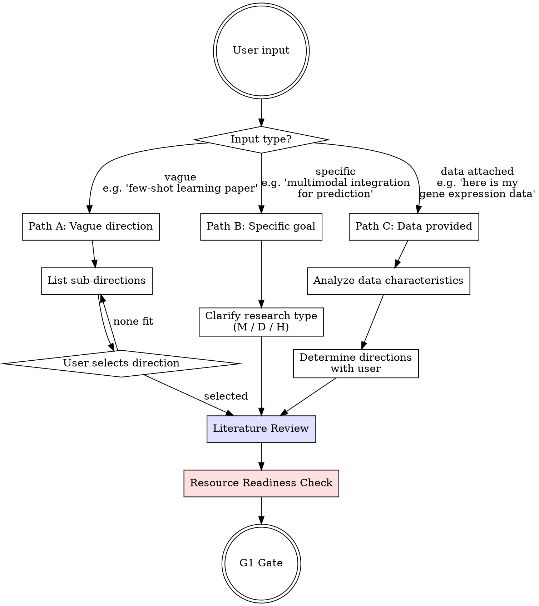

# Research Direction Exploration (Phase 1)

## Overview

Identify research direction, review literature, find gaps, confirm resources. Three entry paths based on user input specificity.

<HARD-GATE>
Do NOT proceed to method design, experiment planning, or any Phase 2 activity until the G1 Gate Checklist at the end of this skill is fully satisfied and the user has approved. No exceptions.
</HARD-GATE>

## Entry Path Selection



## Path A — Vague Direction

User gives a broad topic (e.g., "I want to publish a few-shot learning paper").

1. Search arXiv + Google Scholar for recent activity (last 2 years, top venues)
2. Present 3–5 active sub-directions in this format:

| Sub-direction | Research Heat | Open Problems | Entry Points | Competition |
|---------------|--------------|---------------|--------------|-------------|
| ... | high/med/low | brief list | key papers | high/med/low |

3. Mark recommended option with reasoning
4. User selects → proceed to Literature Review

## Path B — Specific Goal

User states a concrete research goal.

1. Clarify research type with user:
   - **Type M** — New method (model, algorithm, framework)
   - **Type D** — Analyze data (discovery, characterization, mechanism)
   - **Type H** — Hybrid (method + discovery)
2. Proceed directly to Literature Review

## Path C — Data Provided

User supplies a dataset.

1. Analyze data characteristics: dimensions, type (tabular/image/text/graph/multi-modal), scale, quality, label availability
2. Present possible research directions based on data properties
3. Confirm direction and research type with user → proceed to Literature Review

## Literature Review

Execute for ALL paths.

<IMPORTANT>
NEVER fabricate paper contents or citations. If you cannot access or verify the full text of a paper, mark it honestly. Filling a literature table with details you "remember" but cannot verify is academic misconduct.
</IMPORTANT>

### Step 1 — Broad Search

Use web search to find recent papers (last 2 years, top venues):
- Sources: arXiv, Google Scholar, Semantic Scholar, conference proceedings pages
- Collect: titles, authors, venues, abstracts, citation counts, PDF URLs
- Build keyword clusters from initial results
- Target: 15–30 candidate papers for the long list

Save the candidate list with PDF URLs to `docs/02_literature/paper-list.md`.

### Step 2 — Autonomous Full-Text Retrieval

**Try to obtain full text for each candidate paper, in this order:**

1. **Direct PDF download** — Try downloading the PDF to `docs/02_literature/papers/`. Use shell commands (`curl`, `wget`) or any available download tools/APIs. Many sources provide direct PDF links:
   - arXiv: `https://arxiv.org/pdf/XXXX.XXXXX`
   - Semantic Scholar: Open Access PDF links
   - OpenReview: publicly accessible conference papers
   - Publisher open access papers

2. **HTML full text** — If PDF fails, try fetching the HTML version (e.g., arXiv HTML at `https://arxiv.org/html/XXXX.XXXXX`)

3. **API access** — If MCP servers or platform-specific APIs are available (e.g., Semantic Scholar API, institutional proxy), use them

4. **Read downloaded PDFs** — For each successfully downloaded PDF, read it using available file reading tools

After attempting all papers, classify each into one of:

| Status | Meaning |
|--------|---------|
| `full_text` | Full paper successfully obtained and read |
| `abstract_only` | Only title + abstract available; full text inaccessible |
| `download_failed` | PDF URL found but download failed (paywall, 403, etc.) |

### Step 3 — User Assistance (only for what failed)

If any papers remain at `abstract_only` or `download_failed`, present a summary to the user:

```
Literature retrieval report:
  Full text obtained: K papers ✅
  Abstract only / download failed: M papers ⚠️

Papers I could not access:
  1. [Author et al., Year] "Title" — [venue] — URL: [link]
  2. [Author et al., Year] "Title" — [venue] — URL: [link]
  ...

To help me read these, you can:
  A) Download PDFs and place them in: docs/02_literature/papers/
  B) Provide a brief summary of key findings for papers you've read
  C) Tell me which ones to skip (not critical for our direction)

After placing files, just say "papers ready" and I will continue.
```

**When user says "papers ready" (or equivalent):**
1. Scan `docs/02_literature/papers/` for new PDF files
2. Read each new PDF
3. Update the literature table with full-text details
4. Resume the review from where it paused

**If user provides summaries instead of PDFs:**
- Record them with access level `user_summary`
- Use for gap analysis but note lower confidence

**If user says to skip certain papers:**
- Mark as `skipped` and proceed without them
- Note in gap analysis that some sources were not reviewed

### Step 4 — Deep Reading

For the 5–10 most relevant papers (prioritize `full_text`), extract:

| Paper | Access | Problem | Method | Datasets | Metrics | Key Results | Limitations |
|-------|--------|---------|--------|----------|---------|-------------|-------------|

### Step 5 — Gap Analysis

For each identified gap:
- Is it already solved? (check very recent work)
- Why hasn't it been solved?
- How could we approach it?
- Confidence: `high` (based on full text) / `medium` (based on abstracts) / `low` (needs user verification)

### Step 6 — Element Collection by Research Type

| Type M / H | Type D |
|------------|--------|
| Alternative methods | Analysis methods |
| Standard benchmarks | Related findings |
| Evaluation metrics | Domain standards |
| Current SOTA values | Accepted thresholds |

### Step 7 — Outputs

Save to project directory:
- `docs/02_literature/paper-list.md` (full candidate list with URLs and access status)
- `docs/02_literature/literature-review.md` (deep reading table, access level per paper)
- `docs/02_literature/gap-analysis.md` (with confidence levels)
- `docs/02_literature/baseline-collection.md` (Type M / H only)
- `docs/02_literature/papers/` (downloaded/user-provided PDFs)

## Baseline & Alternative Method Early Specification (Type M / H only)

After literature review, **proactively ask the user** about baselines. Many users already know what they want to compare against.

```
I've identified several potential baselines from the literature.
Before we move on, let me check:

1. Do you already have specific methods you want to compare against?
   (e.g., "I want to compare with GraphSAGE, GAT, and GIN")

2. Do you already have results for any methods?
   (e.g., "I already ran Method X on Dataset Y, accuracy was 0.87 ± 0.02")

3. Are there methods you know you must NOT miss?
   (e.g., "reviewers at [venue] will definitely ask about Method Z")
```

**If user provides specific methods:**
- Record them immediately in `docs/02_literature/baseline-collection.md`
- Mark as `user_specified` (highest priority — these MUST appear in final comparison)
- In Phase 3, these become `must_include` baselines automatically

**If user provides pre-existing results:**
- Record in `docs/02_literature/baseline-collection.md` with a `[PRE-COMPUTED]` tag
- Capture: method name, dataset, metric values (mean ± std), seeds used, execution details, source (user's own run / paper-reported / third-party benchmark)
- These will be validated against the evaluation protocol in Phase 3 and may or may not need re-running in Phase 4

**If user says "you decide":**
- System recommends 3–5 from the literature review
- Proceed as normal to Phase 3 for confirmation

## Data & Resource Readiness Check

Before leaving Phase 1, verify every item:

| Item | Status | Action if NOT ready |
|------|--------|-------------------|
| Data availability | user-provided / public / needs collection | If public: provide download script. If needs collection: discuss feasibility. |
| Compute resources | sufficient / insufficient | Discuss alternatives or scope reduction. |
| Tool chain | ready / gaps | Identify missing tools, install or find substitutes. |
| Baselines identified (Type M/H) | user-specified / system-recommended / pending | If none: revisit literature. If user has pre-computed results: record them. |

<HARD-GATE>
Any item NOT ready → discuss with user. Do NOT force through to Phase 2.
</HARD-GATE>

## Red Flags — STOP

- Skipping literature review ("I already know the field")
- Assuming research direction without evidence
- Proceeding without data readiness check
- Jumping to method design before G1 approval
- Selecting a direction without checking competition level
- Ignoring negative signals from gap analysis

## Rationalization Prevention

| Excuse | Reality |
|--------|---------|
| "I know this area well" | Literature evolves monthly. Search anyway. |
| "The user said just start coding" | User intent ≠ skip research workflow. Lit review first. |
| "Gap is obvious" | Obvious gaps are often already solved. Verify. |
| "We can review literature later" | Uninformed method design wastes weeks. Review now. |
| "Data looks fine at a glance" | Glance ≠ analysis. Check dimensions, quality, labels. |
| "Resources aren't my concern" | Infeasible plans waste everyone's time. Check now. |

## Preliminary Novelty Assessment

Before entering G1, invoke `amplify:novelty-classifier` for a preliminary assessment:
- Is the proposed direction a new problem, new method, new theory, new data, or engineering integration?
- If classified as engineering integration or scale-up → warn user before G1

This early check prevents investing months in a direction that lacks sufficient novelty for the target venue.

## G1 Gate Checklist

**ALL items must be satisfied. Present to user for explicit approval.**

- [ ] Domain and sub-domain identified and confirmed by user
- [ ] Research type confirmed (M / D / C / H)
- [ ] Expert persona anchored (reviewer focus areas set in `research-anchor.yaml`)
- [ ] Literature review complete (broad + deep reading)
- [ ] Research gap identified and validated (not already solved)
- [ ] Preliminary novelty assessment completed (novelty-classifier invoked)
- [ ] Target venue estimated (with rationale)
- [ ] Project intent clear (what contribution, for whom)
- [ ] Data and resources assessed as ready
- [ ] `research-anchor.yaml` generated and saved in `docs/01_intake/`
- [ ] User has approved direction to proceed

**Gate passed → invoke problem-validation skill for Phase 2.**
**Any item unchecked → resolve before proceeding.**
