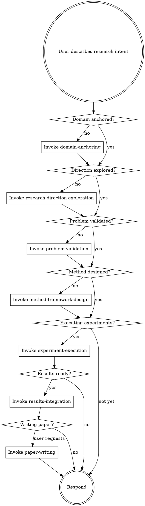

<EXTREMELY-IMPORTANT>
If you think there is even a 1% chance a skill might apply to what you are doing, you ABSOLUTELY MUST invoke the skill.

IF A SKILL APPLIES TO YOUR TASK, YOU DO NOT HAVE A CHOICE. YOU MUST USE IT.

This is not negotiable. This is not optional. You cannot rationalize your way out of this.
</EXTREMELY-IMPORTANT>

## How to Access Skills

**In Cursor:** Use the `Skill` tool. When you invoke a skill, its content is loaded and presented to you—follow it directly.

**In other environments:** Check your platform's documentation for how skills are loaded.

# Using Research Skills

## The Rule

**Invoke relevant or requested skills BEFORE any response or action.** Even a 1% chance a skill might apply means you should invoke the skill to check.

## System Architecture

Amplify operates on three layers:

**Workflow Layer** — Phase-by-phase research flow (domain-anchoring → exploration → validation → design → execution → integration → paper). These tell you WHAT to do next.

**Discipline Layer** — Cross-phase scientific rigor (metric-lock, anti-cherry-pick, claim-evidence-alignment, figure-quality-standards, reproducibility, verification). These tell you WHAT RULES to follow at all times.

**Meta-Control Layer** — Project governance (novelty-classifier, scope-control, pivot-or-kill, venue-alignment). These tell you WHEN to stop, pivot, or escalate.

## Four Gates

Progress between phases requires passing gates:

- **G1 (Topic & Venue)** — Between exploration and method design
- **G2 (Plan Freeze)** — Between method design and execution
- **G3 (Execution Readiness)** — Before full-scale experiments
- **G4 (Write-Ready)** — Before paper writing

No gate may be skipped. Each gate has a checklist that must be fully satisfied.

## Research Workflow Priority

When a user describes research intent, skills apply in this order:

## Discipline Skills — Always Active

Once activated, these skills remain in effect for the rest of the project:

| Skill | Activates | What It Enforces |
|-------|-----------|-----------------|
| metric-lock | After G2 | Evaluation metrics cannot be changed without user permission |
| anti-cherry-pick | Phase 4 start | All seeds reported, failures recorded, no selective reporting |
| claim-evidence-alignment | Phase 5-6 | Every claim maps to evidence; unmapped claims deleted |
| figure-quality-standards | Phase 4-6 | Publication-quality figures: style template, colorblind-safe, vector format, consistent colors |
| reproducibility-driven-research | Phase 4 start | Seeds, environments, scripts all recorded |
| results-verification-protocol | Always | No completion claims without fresh verification |

## Meta-Control Skills — Triggered by Conditions

| Skill | Trigger | What It Does |
|-------|---------|-------------|
| novelty-classifier | Phase 1, 3 | Assesses innovation level, warns if just engineering |
| scope-control | Anytime scope expands | Forces scope reduction when contributions > 2 or story splits |
| pivot-or-kill | 3 consecutive failures | Presents pivot/downgrade/kill options to user |
| venue-alignment | Every gate | Checks progress matches venue requirements |

## Critical Enforcement Rules

These rules are NON-NEGOTIABLE:

1. **Run to completion (Type M)**: Every method must execute its full procedure before results are valid. For iterative methods (DL), train to convergence; for non-iterative methods (RF, SVM), fit fully. Partial runs are NOT experiments.
2. **Iterate before moving on (Type M)**: Minimum 3 rounds of diagnose-hypothesize-fix-measure before declaring failure.
3. **Performance bar**: Method must be competitive with baselines before proceeding to results integration.
4. **Explicit user confirmation for paper writing**: User must say "ready for paper" — do NOT auto-proceed.
5. **Minimum paper quality**: ≥3 figures, ≥2 tables, ≥20 references (conference), substantive sections (600+ word intro, 500+ word related work, 400+ word discussion).
6. **Modular LaTeX**: One `.tex` file per section. Present each section to user individually.
7. **Figure quality**: Every figure must pass the per-figure checklist (readable at print size, axis labels with units, colorblind-safe palette, error bars, self-contained caption, vector format). Apply the style template from the first plot onward. Same method = same color in all figures.

## Red Flags

These thoughts mean STOP—you're rationalizing:

| Thought | Reality |
|---------|---------|
| "Let me just start coding" | Method design and evaluation protocol come first. |
| "This is a simple analysis" | Simple analyses still need a story line and sufficiency criteria. |
| "I know what metric to use" | Metrics must be discussed, locked, and documented. |
| "Let me run a quick experiment" | No experiments before G2 (plan freeze). |
| "The results look good enough" | Run verification. Show numbers. Evidence before claims. |
| "I'll add more baselines later" | Baselines are locked in G2. Define them now. |
| "This negative result isn't useful" | Negative results ARE results. Record them. |
| "Let me adjust the evaluation" | Metric changes require user authorization. Always. |
| "I remember this skill" | Skills evolve. Read current version. |

## Skill Types

**Rigid** (metric-lock, anti-cherry-pick, verification): Follow exactly. No adaptation.

**Flexible** (exploration, method design): Adapt principles to context and research type.

The skill itself tells you which.

## Research Type Awareness

Every decision must account for the project's research type (from research-anchor.yaml):

- **Type M (Method)**: Performance-driven. Needs baselines, ablations, statistical significance.
- **Type D (Discovery)**: Story-driven. Needs analysis breadth, mechanism exploration, alternative hypothesis exclusion.
- **Type C (Tool)**: Utility-driven. Needs usability, benchmarks, documentation.
- **Type H (Hybrid)**: Dual-track. Needs elements from both M and D.

## User Instructions

User instructions say WHAT, not HOW. "Analyze this data" or "Build a model" doesn't mean skip the research workflow. The workflow tells you HOW.
